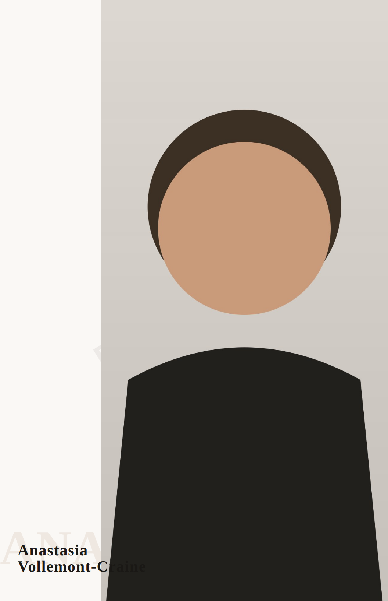
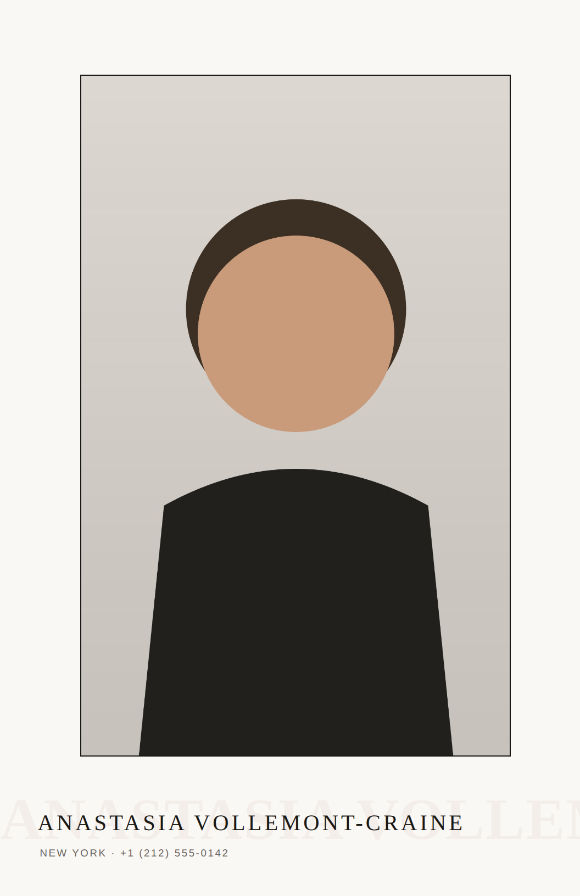
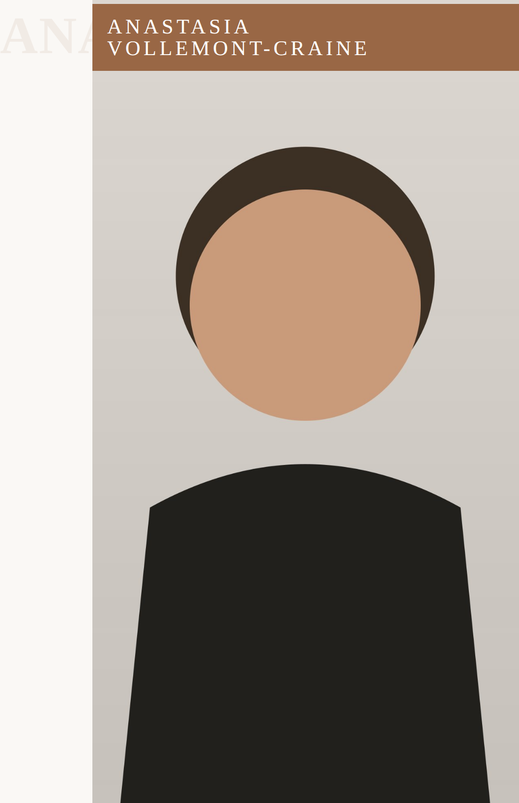

# Comp Card System Audit — July 2026

**Scope:** the full comp card pipeline — composition engine (`src/domains/pdf/`), templates, PDF generation, and the talent-facing surface (`client/src/domains/talent/components/CompCard.jsx`) — audited against (a) real industry comp card standards, (b) the market alternatives talent actually use (Canva, template services, agency-made cards), and (c) live rendered output.

**Method:** full code read of the composition pipeline (~16.5k LOC across 33 modules), plus a live reproduction: the app was booted against a fresh SQLite DB, a synthetic talent profile with six studio-style fixture images was inserted, and the composed engine was rendered across six seeds. Screenshots are in [`evidence/`](evidence/). Market data from current (2026) public sources, cited in §6.

---

## 1. Executive verdict

> **Would a working model or booker trust this card over one they made in Canva?** Not yet — and the reason is not taste, it is *integrity*. The engine's design ambition is genuinely ahead of template tools, but the rendered output can silently violate its own first rule (the name must always read), the variant experience is a slot machine rather than a set of creative directions, and most of the intelligence that would fix both is built but dormant. The system currently ships the *deterministic heuristic floor* of a much smarter architecture.

Three sentences of context for that verdict:

1. **The architecture is not the problem.** The composed engine (design-language → layout-solver → crop-engine → front-program grammar → guardrails) is a real generative system, not templates: geometry is solved per talent, the back page structurally reserves the name/stats/booking chrome, crops are focal-aware with healing, stats are dual-unit, minors get guardian-contact treatment. Nobody selling $19 comp cards has this.
2. **The output is the problem.** In 6 sampled takes, 3 shipped a front where the talent's name visually drowns into the photograph (dark ink overflowing a paper rail onto a dark garment), the "ghost type" motif rendered as clipped glyph fragments in 4, the name was small and bottom-left in 5, and the six "directions" collapsed into ~2 recognizably different layouts with the identical typographic voice. Every complaint in the product feedback (images over the name, lost name prominence, image domination, template feel) reproduced on the first six seeds.
3. **The causes are identifiable and cheap relative to what is already built.** Two geometric-integrity defects (estimated text metrics + crop-space mismatch), one scoring bias (photo coverage rewarded, name presence not), and one product decision (the only user control is a random reseed) account for essentially all of it.

---

## 2. How the system actually works today (verified, not aspirational)

Default request path for both the dashboard preview and PDF download (`/pdf/view/:slug` → `renderStandardView`, `src/domains/pdf/routes/pdf.js:944`):

```
images ─ image-forensics (9×6 luma/detail grid, quiet bands, saliency focal; measured
         on demand w/ 2.2s per-image / 4.5s total budget, cached to images.metadata)
profile ─ stats-formatter (dual-unit, track-aware)  ─┐
archetype + casting analysis ─ design-language       ├─ composition-director ─ plan
Groq art-director brief (KEY-GATED, fails soft)     ─┘        │
                                                    front-program grammar (default ON)
                                                    back-program grammar (8 architectures)
plan ─ compcard-composed.ejs (absolute inch rects) ─ Puppeteer ─ PDF
     └ guardrails (rights, roles, crops, type-safety flag, booking)
```

Key facts established during the audit:

| Capability | Status in production |
|---|---|
| Composed engine (default) | **ON** — classic template only as fallback (`routes/pdf.js:599-618`) |
| Front design-program grammar | **ON** by default (`routes/pdf.js:831-832`) |
| Groq art-director brief | Runs only with `GROQ_API_KEY` + egress; fails soft to null (verified live: `[art-director] failed (403 …) — composing without a brief`) |
| Vision jury (render-K-and-rank) | **NEVER RUNS** — requires `?jury=1`, which no product surface sends (`generator.js:263-305`, `CompCard.jsx:245`) |
| Subject mattes (cutout, negative-space type) | **NEVER RUNS** — `@imgly/background-removal-node` is not in `package.json`; `matteById` is always empty (`routes/pdf.js:761-776`) |
| Real font metrics (opentype.js) | **DEAD CODE** — `composition/perception/text-metrics.js` is required only by its test; no font files are bundled |
| Face detection | **STUB** — `perception/faces.js` fails soft; face zone is a saliency-focal proxy (`type-safety.js:69-78`) |

So the shipped card is produced by the deterministic heuristic floor: estimated glyph advances, a 9×6 luma grid instead of masks, a saliency point instead of a face box, no jury, and (in any environment without a Groq key/egress) no brief. The proposal doc knew this: *"P1 perception deps … not yet installed"*, *"the jury's live wiring is the one remaining opt-in integration"* (`docs/comp-card-frontpage-intelligence-proposal.md` §5–6).

---

## 3. Live reproduction (the evidence)

Six seeds (`take1…take6`), one profile ("Anastasia Vollemont-Craine", 6 images, correct stats), default engine, no Groq. Structures drawn: `matted`, `split`, `photo-dominant`, `split`, `split`, `photo-dominant`.

| Take | Front | What shipped |
|---|---|---|
| take2 |  | **Name half-swallowed by the photo.** "Vollemont-Craine" overflows the paper rail onto the near-black garment; dark ink on dark pixels — the tail of the surname is unreadable. Ghost type clipped mid-glyph under the photo plane. |
| take4 |  | Same failure, different seed: "-Craine" drowns into the torso. Note it is *the same layout* as take2. |
| take1 |  | Matted register — structurally fine, but the ghost echo is amputated at the right trim mid-word ("ANASTASIA VOLLEN…") and collides with the real name's baseline zone; reads as a rendering bug, not layered editorial type. |
| take3 |  | Knockout band motif — the most designed take, but the band pins the name to the extreme top edge, crowding the head under it, and the ghost fragment "ANA" floats amputated on the left rail. |
| take6 |  | Clean and legible — and timid: small name in a bare bottom strip; the "safe" register the engine degrades to. |

Backs, for contrast, are structurally sound (name strip reserved, dual-unit stats, booking hierarchy, gold wordmark + live portfolio URL): [take1](evidence/audit-talent-take1-back.png), [take3](evidence/audit-talent-take3-back.png).

**The safety system did not see any of the front failures.** The engine's meta for take2/take4 reports type-safety clean (name "on paper"), while flagging only rights metadata and back-cell crop cautions. The name-drowning defect is invisible to every guardrail.

---

## 4. Findings

Graded: **P0** = breaks the product's core promise / user trust; **P1** = real quality or product gap a user hits; **P2** = polish, hygiene.

### P0-1 · Rendered name geometry is never verified — names drown into photos

- **Mechanism.** The front program sizes the name box from *estimated* glyph advances — `nameBox()` uses `chars × (advanceEm + trackingEm)` (`composition/front-program/synthesize.js:396-407`) with hand-tuned per-family constants (`font-library.js:263-266`). The renderer then draws the name `white-space: nowrap` with **no overflow guard and no width clamp** (`templates/compcard-composed.ejs:348`). Whenever real glyphs run wider than the estimate (hyphenated surnames, tracking, font fallback before Google Fonts loads, capitalize-vs-upper), the text escapes its verified rect onto the photo plane — where dark ink meets dark pixels and disappears. The placement search verified a rectangle; the page shipped different geometry.
- **Evidence.** take2/take4/take5 fronts. The director path has the same class of bug at lower frequency: `solveNameSizePt` applies a ×0.95 fudge on the same estimated advances (`composition-director.js:604-634`, comment admits "glyph-advance estimates carry error").
- **Why it's P0.** The name is the one non-negotiable element of a comp card front. A card that can misplace it *sometimes* cannot be trusted *ever* — this single defect forces talent back to Canva, where at least what you see is what you get.
- **Fix (seams already exist).**
  1. Bundle the voice font files (e.g. `@fontsource/*` for the ~7 library families) and wire the already-written `perception/text-metrics.js` (`measureLine`/`advanceEmFor`) into `design-language.js:410` and `front-program/synthesize.js` — the proposal doc names this exact step.
  2. Renderer hard guard: the name element clamps/scales to its rect (never `nowrap` unbounded).
  3. Post-render verification: after Puppeteer layout, measure the rendered name's bounding box against photo rects (`page.evaluate` + `getBoundingClientRect`) and re-render once with a repair (shrink/stack/relocate) on violation; emit a `rendered-name-integrity` guardrail **error** otherwise. This closes the loop for every future regression, not just this one.

### P0-2 · Type-safety verification runs in raw-image space, ignoring the crop transform

- **Mechanism.** All on-photo verification — quiet bands, face zone, subject occupancy (`type-safety.js`), and the program's `scoreOverPhoto` (`synthesize.js:115-145`) — maps text rects into the image as if the photo fills its cell exactly. But heroes render `object-fit: cover` with a focal-driven `object-position` (e.g. `50% 18%`, `crop-engine.js:88-102`). Cover-cropping a non-0.647-aspect image shifts and crops which pixels are actually visible: the "verified quiet bottom band" of the raw image may be cropped out entirely, while the band under the name on the page contains the subject's body.
- **Consequence.** Names/stat lines can pass verification and still sit on the talent (the reported "image over the name / name loses prominence" cases with real photography); conversely genuinely safe placements get vetoed, pushing the engine toward its blandest fallbacks. The matte path (`matteNegativeSpace`, `synthesize.js:204-248`) has the same flaw when it lights up.
- **Fix.** One coordinate transform: given cell aspect, image aspect, and objectPosition, map page-space rects to *visible* image space before consulting grids/zones. All three consumers share the same helper. Add crop-transform cases to `type-safety.test.js` (currently green because tests feed uncropped fixtures).

### P0-3 · "Variants" are a slot machine, not creative directions

- **Mechanism.** The talent's only creative control is **"New direction" = a random seed** (`CompCard.jsx:95-97, 368-372`). No named directions, no side-by-side comparison, no hero choice, no board-specific art direction — even though the engine already supports hero/grid locks (`?lockHeroId`, `routes/pdf.js:752`), treatment preferences, stats-side and structure overrides (`composition-director.js` `overrides`), and the classic engine's `layoutFamily/styleVariant` params that the preset schema still carries.
- **Evidence.** Six seeds produced: `split ×3` (near-identical: left rail, small bottom-left name), `photo-dominant ×2`, `matted ×1` — with the **same typographic voice** (`modern-warm`) and same tone label every time, because voice is cast from the tone vector, which is computed from the profile and barely moves between seeds (`design-language.js:397-410`). The user's perception — "reshuffles from templates" — is accurate: seeds vary parameters within one register; they do not vary *direction*.
- **Why it's P0 (product).** The brief for this audit is exactly right: choice among *real creative directions* is what makes generated output feel designed rather than templated. Canva gives full manual agency; Pholio currently offers a dice roll.
- **Fix.** A `?takes=4` (or `POST /compose/takes`) endpoint that returns K plans with **forced structural diversity** — distinct `structure` × voice × name treatment, deduped by the structural-signature hash that already exists (`synthesize.js:591-601`) — presented in the UI as named directions ("Gallery mat", "Full bleed", "Knockout band", "Split field") with real previews, a hero picker (the lock is already plumbed), and per-direction save. Board/market tags on presets (already shipped) become *inputs* to direction generation (a Runway card skews formal/full-length; a Commercial card warm/smiling) — that is the "Pholio intelligence quietly helping" story made tangible.

### P1-4 · The intelligence that fixes the "template feel" is built and dormant

Four subsystems that would visibly separate Pholio from template tools exist in the repo and never execute (see table in §2): the vision jury (`front-program/jury.js` — module + tests done, no caller sets `?jury=1`), subject mattes (dependency never added → the `cutout` structure and negative-space name placement are unreachable, `synthesize.js:279`), real text metrics (P0-1), and face boxes. **Recommendation:** treat "light up the perception/judgment stack" as one initiative: add the matte dependency at upload (or a sidecar worker), bundle fonts, enable the jury on master/download renders only (cost-bounded: K=5 front rasters + one Groq call per download, already budgeted in `generator.js`). The proposal doc's own phasing says P1 perception "immediately fixes residual placement quality."

### P1-5 · Hierarchy is tuned toward the photo and against the name

- The aesthetics scorer rewards photo coverage up to +10 (`synthesize.js:573-577`) and rewards a *lower-third* name position; nothing rewards or floors name presence. Result across seeds: small (~18–24pt on a 5.5×8.5in page) bottom-left names — "the name loses prominence" is a direct consequence of the objective function, not bad luck.
- The ghost-echo primitive is placed with page-level clamps but no *plane-ownership* rule (`synthesize.js:481-494`), so it routinely renders as glyph fragments amputated by the photo plane or the trim — the strongest "this is broken, not designed" signal in the samples.
- **Fix.** (a) Add a name-presence term (e.g. rendered name width ≥ ~40% of page width or ≥ a pt floor scaled by treatment) and let size trade against photo coverage; (b) ghost echo must live entirely on one plane (paper or verified-quiet photo region) or not at all; (c) let the knockout band count *toward* name prominence — it is currently the only motif that makes the name loud, and it is energy-gated to a minority of draws.

### P1-6 · Saved cards are not frozen designs

Presets persist only `{seed, locks, board, market}` (`CompCard.jsx:21-31`; `comp_card_presets`). Determinism holds only per engine version — any engine change silently redesigns every saved card, including the **default card that `/apply` attaches to agency submissions**. An artifact sent to agencies must be immutable. **Fix:** persist the composed plan JSON (+ engine version) at save time and render presets from the stored plan; reseed only on explicit "redesign".

### P1-7 · Guardrail failures surface to talent as "Needs photos"

`CompCard.jsx:225-234` collapses every `guardrails.status === 'fail'` into the "Needs photos" label and a disabled download. In the live run, the actual blockers were missing distribution-rights metadata — nothing to do with photo count. A talent told "needs photos" while their real blocker is rights/type-safety/crops gets coached wrong (an industry-credibility tell). **Fix:** map guardrail classes to accurate, actionable copy (rights → "confirm usage rights on 3 photos", type-safety → "we couldn't verify a safe name placement — try a different hero"), and verify the uploader always seeds `image_rights` so real accounts don't hit the rights blocker invisibly.

### P2 · Hygiene and polish

- **P2-8.** The premium motifs are mostly unreachable in practice: cutout needs mattes (never), spine name needs formality ≥ 0.6 + an 8% roll (`design-language.js:434`), knockout needs an on-photo name (which needs forensics + quiet bands). Shipped variety ≈ 3 structures.
- **P2-9.** Three front templates coexist (`compcard.ejs` legacy 1-page, `compcard-standard.ejs` classic, `compcard-composed.ejs`); classic is the silent fallback, and classic *is* the fixed-template look the product is trying to escape. Consider making composed-failure loud (log + telemetry) rather than silently shipping the template.
- **P2-10.** PDF renders depend on Google Fonts at runtime (`compcard-composed.ejs:150-152`) — a fonts CDN hiccup silently reflows every card (and interacts with P0-1). Bundling fonts (P1-4) removes the dependency.
- **P2-11.** `src/routes/chat.js:17` instantiates the Groq client at module load — the whole app crashes at boot without `GROQ_API_KEY` (reproduced). Lazy-init like the rest of the codebase.
- **P2-12.** `--disable-web-security` in the serverless Puppeteer args (`generator.js:221`) deserves a second look; it is not needed for same-origin card renders.

### What is already right (keep it)

Correct industry vocabulary and artifacts throughout (comp card vs digitals sheet as separate objects with opposite rules; boards/markets on presets; go-see-ready booking block). Dual-unit stats with track awareness. Guardian-contact treatment for minors and consent gating in the UI (`CompCard.jsx:279-288`). Structural chrome reservation on the back (name/stats/booking can't be covered there). Crop healing that swaps/trades/mats instead of shipping a destroyed figure. Full-length guarantee on the back. Print bleed (`?print=1`) and the 5.5×8.5 standard. The gold wordmark linking to the live portfolio — a genuine differentiator no template service offers.

---

## 5. Industry-lens summary (Booker's read)

**INDUSTRY AUDIT — comp card generation · audience: talent (artifact consumed by agencies/casting)**
**Verdict:** the data model and back page would pass a booker's glance; the front page would not survive the first card where the name sinks into a jacket — and one such card in a stack marks the whole platform amateur.

- The front is the leave-behind's face: **one strong image + the name**. Industry reality says the name is identity; Pholio's engine treats it as a layout element that can lose a fight with the photo (P0-1/P0-2/P1-5).
- 3–5 frames showing range on the back with stats: **met** (4-frame default, full-length pinned to a portrait cell).
- Stats dual-unit and structured: **met**. Recency nudges exist (6-month warning → talent-facing suggestion): good.
- Representation vs direct bookings hierarchy: **met**, including the guardian-contact convention for minors.
- One gap worth naming: a card is *per board/per market* in real life. The preset tags exist; the design should *respond* to them (P0-3 fix folds this in).

---

## 6. Market reality: what Pholio must beat

What talent actually do today (2026):

| Route | Cost | What they get | Pholio's edge to claim |
|---|---|---|---|
| **Canva DIY** (dominant for new faces) | $0 design + $15–40/100 prints | Full manual control, WYSIWYG, decent templates; quality entirely dependent on the talent's design judgment | Zero-effort professional result **iff** output is never wrong; auto-synced stats; live portfolio link |
| **Template services** (Sedcard24 etc.) | ~$19 digital; ~$99 designer service | Guided form → fixed templates; instant PDF/JPG | Pholio is *already* beyond this architecturally — but must *look* it |
| **Freelance designer** | $50–200 | Human taste, one-off | Directions + jury = repeatable taste at $0 marginal cost |
| **Agency-made** | $100–300 (often deducted from earnings) | The agency's house template; correct by construction | For unrepresented/multi-market talent, Pholio can be "agency-grade before you have the agency" |

Sources: [Get Scouted — What Is a Comp Card (2026)](https://www.getscouted.co/articles/what-is-a-comp-card), [The Model Guide — comp card sizes & templates](https://themodelguide.com/guides/model-comp-card), [Sedcard24 pricing/creator](https://sedcard24.com/comp-card), [Backstage — making comp cards stand out](https://www.backstage.com/magazine/article/how-to-make-your-comp-cards-stand-out-72057/), [Canva model templates](https://www.canva.com/templates/s/model/), [Photogenics — comp card measurements](https://photogenicsmedia.com/glossary/comp-card-measurements-what-you-need-to-know-for-a-perfect-comp-card/).

The consistent editorial guidance across these sources: minimal layout, photos and stats carry the card, name prominent, nothing flashy, format exactly standard. **The bar to beat Canva is therefore not more decoration — it is (1) never-wrong output, (2) visible taste, (3) meaningful choice, (4) the things a static PDF tool cannot do** (live-linked wordmark, auto-current stats, board/market-aware directions, application integration). Pholio already owns (4); this audit is the path to (1)–(3).

---

## 7. Recommended roadmap (order matters)

1. **Geometric integrity sprint (fixes P0-1, P0-2).** Bundle fonts + wire `text-metrics.js`; crop-space transform for all band/subject checks; renderer overflow guards; post-render name-integrity verification + guardrail. *Exit test: 500 seeds × 20 name shapes × varied pools → zero rendered name/photo collisions, zero clipped display type.*
2. **Hierarchy rebalance (P1-5).** Name-presence floor in the scorer; ghost-echo plane ownership; knockout as a first-class name-prominence tool.
3. **Directions, not reshuffles (P0-3).** K structurally-distinct takes endpoint + named-direction picker UI + hero lock exposure + board/market-conditioned generation. Keep "shuffle" as a secondary control, honestly labeled.
4. **Light the dormant stack (P1-4).** Mattes at upload → cutout/negative-space motifs; jury on download/master renders; faces if cheap. Each unlock expands *real* variety, feeding step 3.
5. **Freeze saved cards (P1-6)** — persist plans with engine version.
6. **Honest status + coaching copy (P1-7).**
7. **Hygiene (P2-9…12)** opportunistically alongside.

A note on sequencing: steps 1–2 are prerequisites for everything else. Marketing "creative directions" while any direction can still eat the talent's name would burn trust twice.

---

*Audit artifacts: fixture generator and screenshot harness live in the session scratchpad (synthetic images only; the `audit-talent` profile is local dev data, not committed). Evidence PNGs in `evidence/` are renders of synthetic fixtures — no real talent imagery.*
