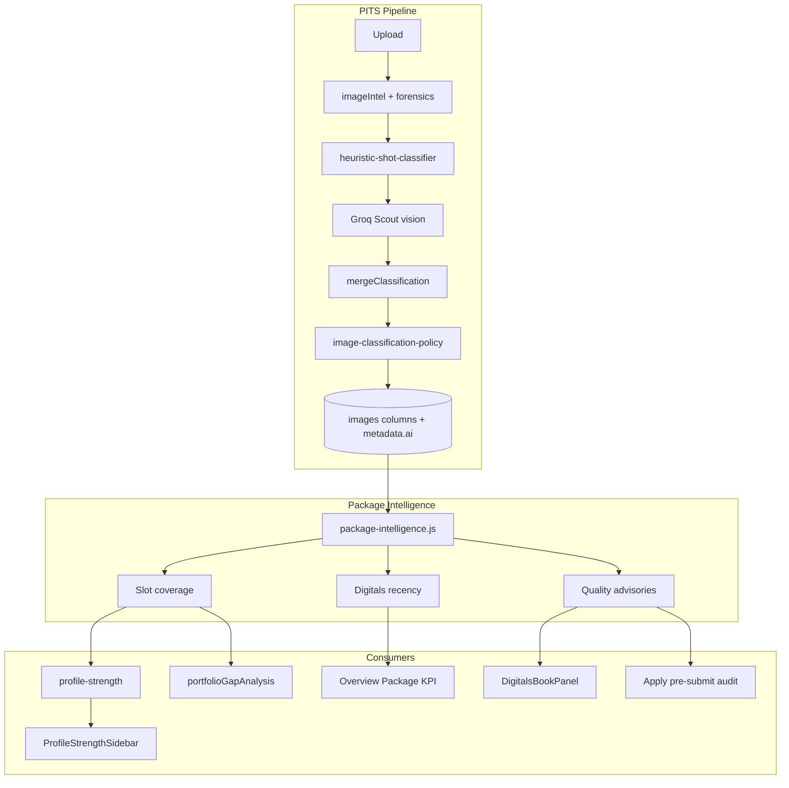

# PITS Final + Package Intelligence — Implementation Plan

> **For agentic workers:** REQUIRED SUB-SKILL: Use superpowers:subagent-driven-development (recommended) or superpowers:executing-plans to implement this plan task-by-task. Steps use checkbox (`- [ ]`) syntax for tracking.

**Goal:** Ship the production-final Pholio Image Typing Service (PITS) as the foundation for Package Intelligence — automatic per-image classification, digitals-vs-book correctness, recency and quality advisories, and pre-submit package audit — wired into readiness, media, apply, and overview.

**Architecture:** Three layers: (1) **PITS pipeline** — heuristics + Groq Scout vision + policy router on every upload; (2) **Package Intelligence** — shared deterministic module consuming classified images + AI signals to produce slot coverage, recency, and advisories; (3) **Consumers** — profile strength, DigitalsBookPanel, Apply Send scene, Overview Package KPI. Manual control preserved: propose → confirm → commit; no chatbot UI.

**Tech Stack:** Node 20 / Express 5, Knex, Groq (`llama-4-scout` vision, `llama-3.3-70b` optional copy), React 19 / TanStack Query, existing `shot_type` / `style_type` / `image_type` columns.

**Design spec (baseline):** `docs/superpowers/specs/2026-06-22-image-typing-service-design.md`  
**Industry references:** `.cursor/skills/industry/reference/standards.md` §3–4, `lifecycle.md` §2

---

## 0. Industry context (why this system exists)

### What agencies actually judge on submission

An inbound submission is **digitals + stats**, not a glamour portfolio (`lifecycle.md` §2). Bookers triage in seconds:

1. **Is this a current digitals set?** (≤3 months; stale = discounted)
2. **Are these raw digitals or styled book shots mislabeled?** (#1 rejection cause for new faces)
3. **Does the set cover standard slots?** headshot, full-length, profile, smile, back
4. **Are stats present and plausible?** (structured, dual-unit — separate from PITS)

### Digitals vs book — opposite rules

| Object | Industry rule | Product failure mode |
|--------|---------------|---------------------|
| **Digitals / polaroids** | Raw, plain background, minimal makeup, form-fitting neutral clothes, no retouch | Portfolio shots tagged as digitals |
| **Book / portfolio** | Curated styled work showing range | Untyped frames; no editorial/commercial breadth visible |
| **Comp card** | 1 hero + 3–4 range + stats | Wrong image pulled because slots untyped |

PITS exists to make Pholio **speak this vocabulary automatically** (`shot_type`, `image_type`, `style_type`) and Package Intelligence to **act on it** (readiness gaps, apply warnings, recency nudges).

### Where misclassification creates friction

| Actor | Pain |
|-------|------|
| **Talent** | Manual tagging tedium; false “ready” when portfolio headshot counts as digital; anxiety at Send |
| **Agency booker** | Opens submission, sees retouched “digital,” moves on; incomplete set wastes triage time |
| **Pholio trust** | Readiness % green while digitals are 8 months old or mislabeled |

---

## 1. Current state vs production target

### Already shipped (P0–P2 partial)

| Component | Location | Status |
|-----------|----------|--------|
| Heuristic shot classifier | `src/domains/ai/heuristic-shot-classifier.js` | ✅ Basic face-geometry rules |
| Groq Scout classifier | `src/domains/ai/classify-portfolio-image.js` | ✅ Async JSON classification |
| Policy router + feedback | `src/domains/talent/services/image-classification-policy.js` | ✅ Auto shot/image_type; style never auto-writes |
| Orchestrator | `src/domains/talent/services/run-image-classification.js` | ✅ Fire-and-forget on upload |
| Upload hook | `src/domains/talent/routes/media.js:827` | ✅ `setImmediate` per image |
| Review strip + captions | `ClassificationReviewStrip.jsx`, `MediaWorkspace.jsx` | ✅ Polling, undo toast |
| Digitals readiness matrix | `profile-readiness-images.js` (server + client mirror) | ✅ Slot matching via columns |
| Gap analysis | `portfolioGapAnalysis.js`, `bookIntelligence.js` | ✅ Rule-based suggestions |
| Apply digitals advisory | `ApplyExperience.jsx` | ⚠️ Partial — wrong headshot/full-body check |
| Tests | `heuristic-shot-classifier`, `image-classification-policy`, `profile-strength` | ✅ Core unit tests |
| Backfill + calibration scripts | `scripts/backfill-image-classification.js`, `analyze-classification-feedback.js` | ✅ Dev tooling |

### Gaps blocking “production final”

| Gap | Severity | Impact |
|-----|----------|--------|
| Apply readiness uses raw `hasShotType` — portfolio headshot counts as complete | **P0** | False “Ready to send” |
| No digitals **recency** (90-day rule) in readiness or overview | **P1** | Stale sets read as ready |
| No **quality advisories** (styled-as-digital, busy background) | **P1** | Core Package Intelligence missing |
| No shared **Package Intelligence** module — logic scattered | **P1** | Hard to maintain consumers |
| Groq prompt lacks explicit digitals-vs-book industry rules | **P1** | Misclassification rate |
| `style_type` never auto-applied (intentional in policy) | **P2** | Manual tagging for book shots |
| No discover reindex after classification | **P2** | Stale agency search metadata |
| No upload concurrency guard for Groq | **P2** | Rate-limit failures on batch upload |
| Heuristic cannot detect `back` without face | **P2** | Back shots always need VLM |
| `captured_at` not set on upload | **P2** | Recency falls back to `created_at` only |

---

## 2. Target architecture



### Canonical modules (final)

| Module | Path | Responsibility |
|--------|------|----------------|
| PITS orchestrator | `src/domains/talent/services/run-image-classification.js` | Upload → classify → persist |
| Package Intelligence (server) | `src/domains/talent/services/package-intelligence.js` | **NEW** — slots, recency, advisories, apply audit |
| Package Intelligence (client) | `client/src/shared/utils/packageIntelligence.js` | **NEW** — mirror of server logic |
| Readiness images | `profile-readiness-images.js` | Low-level slot predicates (keep; PI imports these) |
| Gap analysis | `portfolioGapAnalysis.js` | Thin wrapper over PI slot checks |

### Quality signal schema (extends spec §4.3)

Stored at `metadata.ai.signals` (from Groq + forensics):

```json
{
  "expression": "neutral | smile | serious",
  "pose_yaw": "front | three_quarter | profile_left | profile_right | back",
  "body_visibility": "face_only | bust | three_quarter | full_length",
  "background": "plain | studio | environmental",
  "styling_register": "natural | polished | editorial",
  "retouch_likelihood": "none | light | heavy",
  "makeup_level": "none | minimal | styled",
  "digitals_suitability": "good | questionable | poor"
}
```

`digitals_suitability` is derived in Package Intelligence from signals — not a new DB enum.

### Advisory catalog (Package Intelligence output)

| Advisory ID | Trigger | Industry reason |
|-------------|---------|-----------------|
| `portfolio_as_digital` | `image_type=digital` + `styling_register` ∈ {polished, editorial} OR `retouch_likelihood=heavy` | Digitals must read raw |
| `busy_background` | digital slot + `background=environmental` + low forensics quietness | Plain wall expected |
| `stale_digitals` | oldest digital-slot image > 90 days | Agencies discount >3 month digitals |
| `missing_slot` | standard checklist gap | Incomplete set |
| `pending_classification` | `shot_type` null or `band=pending` in package | Booker can't scan package |
| `three_quarter_not_full_length` | submission uses 3/4 where full-length expected | Proportions unclear |

---

## 3. Constants

Create `src/shared/constants/package-intelligence.js` (server) and mirror in client:

```javascript
"use strict";

/** Industry norm: digitals expected current within ~3 months (standards.md §3). */
const DIGITALS_MAX_AGE_DAYS = 90;

/** Warn when digitals age exceeds this; block nothing. */
const DIGITALS_STALE_DAYS = DIGITALS_MAX_AGE_DAYS;

/** Minimum book frames before "range" advisory clears. */
const BOOK_MIN_FRAME_COUNT = 5;

/** Groq parallel calls per profile during batch upload. */
const PITS_MAX_CONCURRENT_VISION = 3;

module.exports = {
  DIGITALS_MAX_AGE_DAYS,
  DIGITALS_STALE_DAYS,
  BOOK_MIN_FRAME_COUNT,
  PITS_MAX_CONCURRENT_VISION,
};
```

---

## 4. Implementation tasks

### Task 1: Industry-enhanced Groq prompt

**Files:**
- Modify: `src/domains/ai/classify-portfolio-image.js`
- Test: `tests/ai/classify-portfolio-image.test.js` (new)

- [ ] **Step 1: Write failing test for prompt content**

```javascript
const { buildPrompt } = require("../../src/domains/ai/classify-portfolio-image");

describe("classify-portfolio-image prompt", () => {
  test("includes digitals vs portfolio industry rules", () => {
    const prompt = buildPrompt({ heuristicDraft: {}, forensicsSummary: "" });
    expect(prompt).toMatch(/digitals|polaroid/i);
    expect(prompt).toMatch(/plain background/i);
    expect(prompt).toMatch(/retouch/i);
    expect(prompt).toContain("retouch_likelihood");
    expect(prompt).toContain("digitals_suitability");
  });
});
```

- [ ] **Step 2: Run test — expect FAIL**

Run: `npx jest tests/ai/classify-portfolio-image.test.js -v`  
Expected: FAIL — `buildPrompt` not exported

- [ ] **Step 3: Export `buildPrompt` and enhance prompt text**

In `classify-portfolio-image.js`, export `buildPrompt` and replace prompt body with industry-aware version:

```javascript
function buildPrompt({ heuristicDraft, forensicsSummary, styleImageOnly = false }) {
  const shotLocked =
    styleImageOnly && heuristicDraft?.shot_type
      ? `\nHeuristic locked shot_type as "${heuristicDraft.shot_type}" (confidence ${heuristicDraft.confidence}). Return that shot_type unchanged; focus on style_type, image_type, and quality signals.`
      : "";

  return `You classify talent portfolio photos for a professional modeling agency platform.

INDUSTRY RULES (critical):
- DIGITALS / POLAROIDS: raw, unretouched, minimal makeup, plain background (white wall), form-fitting neutral clothing, current look. image_type MUST be "digital".
- BOOK / PORTFOLIO: styled, editorial, or commercial campaign/test work. image_type MUST be "portfolio".
- Never label heavy retouching, studio glamour, or styled editorial work as "digital".
- A phone photo against a plain wall in neutral clothes = digital. A magazine-style shot = portfolio.

Allowed enum values (exact strings or null):
- shot_type: ${SHOT_TYPE_VALUES.join(", ")}
- style_type: ${STYLE_TYPE_VALUES.join(", ")}
- image_type: ${IMAGE_TYPE_VALUES.join(" | ")}

Heuristic draft: ${JSON.stringify(heuristicDraft || {})}
Image signals: ${forensicsSummary || "none"}${shotLocked}

Return JSON only:
{
  "shot_type": string or null,
  "style_type": string or null,
  "image_type": string or null,
  "confidence": { "shot_type": 0-1, "style_type": 0-1, "image_type": 0-1 },
  "shot_type_alternates": [{ "value": string, "confidence": 0-1 }],
  "signals": {
    "expression": "neutral | smile | serious",
    "pose_yaw": "front | three_quarter | profile_left | profile_right | back",
    "body_visibility": "face_only | bust | three_quarter | full_length",
    "background": "plain | studio | environmental",
    "styling_register": "natural | polished | editorial",
    "retouch_likelihood": "none | light | heavy",
    "makeup_level": "none | minimal | styled"
  },
  "reasoning": "one sentence, agency-facing, no hype",
  "uncertainty_factors": []
}`;
}
```

Update `module.exports` to include `buildPrompt`.

- [ ] **Step 4: Run test — expect PASS**

Run: `npx jest tests/ai/classify-portfolio-image.test.js -v`

- [ ] **Step 5: Commit**

```bash
git add src/domains/ai/classify-portfolio-image.js tests/ai/classify-portfolio-image.test.js
git commit -m "feat(pits): industry-aware Groq classification prompt"
```

---

### Task 2: Enable style_type auto-apply with audit sampling

**Files:**
- Modify: `src/domains/talent/services/image-classification-policy.js:144-146`
- Modify: `tests/ai/image-classification-policy.test.js`

- [ ] **Step 1: Update failing test — style_type auto-writes at high confidence**

Replace test `"style_type never auto-writes to column"` with:

```javascript
test("style_type auto-writes at high confidence when unset", () => {
  const r = applyClassificationPolicy({
    imageRow: { id: "00000000-0000-4000-8000-000000000001", shot_type: "headshot", style_type: null, image_type: "portfolio", metadata: {} },
    classification: {
      shot_type: "headshot",
      style_type: "editorial",
      image_type: "portfolio",
      confidence: { shot_type: 0.92, style_type: 0.91, image_type: 0.88 },
      signals: {},
      uncertainty_factors: [],
    },
  });
  expect(r.columnUpdates.style_type).toBe("editorial");
});
```

- [ ] **Step 2: Run test — expect FAIL**

Run: `npx jest tests/ai/image-classification-policy.test.js -v`

- [ ] **Step 3: Remove style_type skip in policy loop**

In `image-classification-policy.js`, delete the block:

```javascript
if (field === "style_type") {
  continue;
}
```

Style fields use same audit sampling as shot_type via `stableAuditSample`.

- [ ] **Step 4: Run tests — expect PASS**

Run: `npx jest tests/ai/image-classification-policy.test.js -v`

- [ ] **Step 5: Commit**

```bash
git add src/domains/talent/services/image-classification-policy.js tests/ai/image-classification-policy.test.js
git commit -m "feat(pits): auto-apply style_type at high confidence"
```

---

### Task 3: Upload concurrency limiter + captured_at default

**Files:**
- Create: `src/domains/talent/services/pits-queue.js`
- Modify: `src/domains/talent/routes/media.js`
- Modify: `src/domains/talent/services/run-image-classification.js`

- [ ] **Step 1: Create per-profile concurrency queue**

```javascript
"use strict";

const {
  PITS_MAX_CONCURRENT_VISION,
} = require("../../../shared/constants/package-intelligence");

const profileQueues = new Map();

function getProfileQueue(profileId) {
  if (!profileQueues.has(profileId)) {
    profileQueues.set(profileId, { running: 0, pending: [] });
  }
  return profileQueues.get(profileId);
}

function enqueuePitsJob(profileId, jobFn) {
  const q = getProfileQueue(profileId);
  return new Promise((resolve, reject) => {
    q.pending.push({ jobFn, resolve, reject });
    drainQueue(profileId);
  });
}

async function drainQueue(profileId) {
  const q = getProfileQueue(profileId);
  while (q.running < PITS_MAX_CONCURRENT_VISION && q.pending.length > 0) {
    const { jobFn, resolve, reject } = q.pending.shift();
    q.running += 1;
    try {
      const result = await jobFn();
      resolve(result);
    } catch (err) {
      reject(err);
    } finally {
      q.running -= 1;
      if (q.pending.length === 0 && q.running === 0) {
        profileQueues.delete(profileId);
      } else {
        drainQueue(profileId);
      }
    }
  }
}

module.exports = { enqueuePitsJob };
```

- [ ] **Step 2: Wire queue in media.js upload hook**

Replace direct `setImmediate(() => runImageClassification(...))` with:

```javascript
const { enqueuePitsJob } = require("../services/pits-queue");

// inside upload success loop:
for (const row of uploadedImageRows) {
  enqueuePitsJob(profile.id, () => runImageClassification(knex, row.id)).catch(
    (err) => console.warn("[PITS] classification failed:", row.id, err.message),
  );
}
```

- [ ] **Step 3: Set captured_at on insert when null**

In media upload insert payload, add:

```javascript
captured_at: knex.fn.now(),
```

(Only when column exists — migration `20260326120000` already added it.)

- [ ] **Step 4: Commit**

```bash
git add src/shared/constants/package-intelligence.js src/domains/talent/services/pits-queue.js src/domains/talent/routes/media.js
git commit -m "feat(pits): concurrency queue and captured_at on upload"
```

---

### Task 4: Debounced discover reindex after classification

**Files:**
- Modify: `src/domains/talent/services/run-image-classification.js`

- [ ] **Step 1: Add debounced reindex helper**

At top of `run-image-classification.js`:

```javascript
const { reindexDiscoverProfile } = require("../../ai/embeddings");

const reindexTimers = new Map();

function scheduleDiscoverReindex(knex, profileId) {
  if (!profileId) return;
  if (reindexTimers.has(profileId)) {
    clearTimeout(reindexTimers.get(profileId));
  }
  reindexTimers.set(
    profileId,
    setTimeout(() => {
      reindexTimers.delete(profileId);
      reindexDiscoverProfile(knex, profileId).catch((err) =>
        console.warn("[PITS] reindex failed:", profileId, err.message),
      );
    }, 5000),
  );
}
```

- [ ] **Step 2: Call after successful classification update**

After `knex("images").where({ id: imageId }).update(updatePayload)`:

```javascript
scheduleDiscoverReindex(knex, imageRow.profile_id);
```

- [ ] **Step 3: Commit**

```bash
git add src/domains/talent/services/run-image-classification.js
git commit -m "feat(pits): debounced discover reindex after classification"
```

---

### Task 5: Package Intelligence module (server)

**Files:**
- Create: `src/domains/talent/services/package-intelligence.js`
- Create: `src/shared/constants/package-intelligence.js`
- Test: `tests/talent/package-intelligence.test.js`

- [ ] **Step 1: Write failing tests**

```javascript
const {
  analyzePackageIntelligence,
  getImageAgeDays,
} = require("../../src/domains/talent/services/package-intelligence");

describe("package-intelligence", () => {
  const now = new Date("2026-06-24T12:00:00.000Z");

  test("flags portfolio headshot as not counting for digital headshot slot", () => {
    const images = [
      {
        id: "1",
        shot_type: "headshot",
        image_type: "portfolio",
        style_type: "editorial",
        created_at: now.toISOString(),
      },
    ];
    const result = analyzePackageIntelligence({ images, now });
    expect(result.slots.headshot).toBe(false);
    expect(result.slots.hasStyledHeadshot).toBe(true);
  });

  test("detects stale digitals", () => {
    const old = new Date(now);
    old.setDate(old.getDate() - 100);
    const images = [
      {
        id: "1",
        shot_type: "headshot",
        image_type: "digital",
        created_at: old.toISOString(),
        captured_at: old.toISOString(),
      },
    ];
    const result = analyzePackageIntelligence({ images, now });
    expect(result.recency.isStale).toBe(true);
    expect(result.advisories.some((a) => a.id === "stale_digitals")).toBe(true);
  });

  test("portfolio_as_digital advisory for styled digital tag", () => {
    const images = [
      {
        id: "1",
        shot_type: "headshot",
        image_type: "digital",
        metadata: {
          ai: {
            classification: {
              signals: { styling_register: "editorial", retouch_likelihood: "heavy" },
            },
          },
        },
        created_at: now.toISOString(),
      },
    ];
    const result = analyzePackageIntelligence({ images, now });
    expect(result.advisories.some((a) => a.id === "portfolio_as_digital")).toBe(true);
  });
});
```

- [ ] **Step 2: Run test — expect FAIL**

Run: `npx jest tests/talent/package-intelligence.test.js -v`

- [ ] **Step 3: Implement module**

```javascript
"use strict";

const {
  analyzeDigitalsReadiness,
  isHeadshotImage,
  isFullBodyImage,
  isDigitalSlot,
} = require("./profile-readiness-images");
const { DIGITALS_STALE_DAYS } = require("../../../shared/constants/package-intelligence");

function parseMetadata(raw) {
  if (!raw) return {};
  if (typeof raw === "object") return raw;
  try {
    return JSON.parse(raw);
  } catch {
    return {};
  }
}

function parseSignals(img) {
  const meta = parseMetadata(img?.metadata);
  return (
    meta?.ai?.signals ||
    meta?.ai?.classification?.signals ||
    {}
  );
}

function getImageAgeDays(img, now = new Date()) {
  const raw = img?.captured_at || img?.created_at;
  if (!raw) return null;
  const d = new Date(raw);
  if (Number.isNaN(d.getTime())) return null;
  return Math.floor((now.getTime() - d.getTime()) / 86400000);
}

function digitalSlotImages(images) {
  return (images || []).filter(isDigitalSlot);
}

function analyzeRecency(images, now = new Date()) {
  const digitals = digitalSlotImages(images);
  const ages = digitals
    .map((img) => ({ id: img.id, days: getImageAgeDays(img, now) }))
    .filter((x) => x.days != null);
  if (!ages.length) {
    return { isStale: false, oldestDays: null, staleImageIds: [] };
  }
  const oldest = ages.reduce((a, b) => (a.days >= b.days ? a : b));
  const staleImageIds = ages.filter((a) => a.days > DIGITALS_STALE_DAYS).map((a) => a.id);
  return {
    isStale: oldest.days > DIGITALS_STALE_DAYS,
    oldestDays: oldest.days,
    staleImageIds,
  };
}

function buildAdvisories(images, slots, recency) {
  const advisories = [];
  const list = images || [];

  if (recency.isStale) {
    advisories.push({
      id: "stale_digitals",
      severity: "warn",
      message: `Your digitals are ${recency.oldestDays} days old. Agencies expect a fresh set within ${DIGITALS_STALE_DAYS} days.`,
      imageIds: recency.staleImageIds,
    });
  }

  for (const img of list) {
    if (!isDigitalSlot(img)) continue;
    const signals = parseSignals(img);
    const styling = String(signals.styling_register || "").toLowerCase();
    const retouch = String(signals.retouch_likelihood || "").toLowerCase();
    if (
      styling === "editorial" ||
      styling === "polished" ||
      retouch === "heavy"
    ) {
      advisories.push({
        id: "portfolio_as_digital",
        severity: "warn",
        message:
          "This frame reads as styled book work, not a raw digital. Agencies may set it aside.",
        imageIds: [img.id],
      });
    }
    const bg = String(signals.background || "").toLowerCase();
    if (bg === "environmental") {
      advisories.push({
        id: "busy_background",
        severity: "info",
        message:
          "Digitals work best on a plain background — this frame reads environmental.",
        imageIds: [img.id],
      });
    }
  }

  if (!slots.headshot) {
    advisories.push({
      id: "missing_slot",
      severity: "warn",
      message: "Add a clean, natural headshot to open your digitals set.",
      imageIds: [],
      slot: "headshot",
    });
  }
  if (!slots.fullBody) {
    advisories.push({
      id: "missing_slot",
      severity: "warn",
      message: "Add a full-length frame so bookers can verify proportions.",
      imageIds: [],
      slot: "full_body",
    });
  }

  const untyped = list.filter((img) => !img?.shot_type);
  if (untyped.length) {
    advisories.push({
      id: "pending_classification",
      severity: "info",
      message: `${untyped.length} frame${untyped.length === 1 ? "" : "s"} still need a type read.`,
      imageIds: untyped.map((i) => i.id),
    });
  }

  return advisories;
}

function analyzePackageIntelligence({ images = [], now = new Date() } = {}) {
  const list = Array.isArray(images) ? images : [];
  const digitals = analyzeDigitalsReadiness(list);
  const recency = analyzeRecency(list, now);
  const slots = {
    headshot: list.some(isHeadshotImage),
    fullBody: list.some(isFullBodyImage),
    profile: digitals.hasProfile,
    smile: digitals.hasSmile,
    back: digitals.hasBack,
    editorial: digitals.hasEditorial,
    lifestyle: digitals.hasLifestyle,
    hasStyledHeadshot: list.some(
      (img) =>
        String(img?.shot_type) === "headshot" &&
        String(img?.image_type) === "portfolio",
    ),
  };
  const advisories = buildAdvisories(list, slots, recency);
  return {
    slots,
    recency,
    advisories,
    digitals,
    isSubmissionReady: slots.headshot && slots.fullBody && !recency.isStale,
  };
}

function auditSubmissionPackage({ images = [], now = new Date() } = {}) {
  const intel = analyzePackageIntelligence({ images, now });
  return {
    ...intel,
    blockers: intel.advisories.filter((a) => a.severity === "warn"),
    canSend: intel.slots.headshot && intel.slots.fullBody,
  };
}

module.exports = {
  analyzePackageIntelligence,
  auditSubmissionPackage,
  getImageAgeDays,
  parseSignals,
};
```

- [ ] **Step 4: Run tests — expect PASS**

Run: `npx jest tests/talent/package-intelligence.test.js -v`

- [ ] **Step 5: Commit**

```bash
git add src/shared/constants/package-intelligence.js src/domains/talent/services/package-intelligence.js tests/talent/package-intelligence.test.js
git commit -m "feat: package intelligence module for PITS consumers"
```

---

### Task 6: Client mirror — packageIntelligence.js

**Files:**
- Create: `client/src/shared/utils/packageIntelligence.js`
- Create: `client/src/shared/constants/packageIntelligence.js`

- [ ] **Step 1: Port server module to ES modules**

Copy logic from Task 5, importing from `./profileReadinessImages` instead of server paths. Export:

```javascript
export { analyzePackageIntelligence, auditSubmissionPackage, getImageAgeDays };
export { DIGITALS_STALE_DAYS } from '../constants/packageIntelligence';
```

- [ ] **Step 2: Commit**

```bash
git add client/src/shared/utils/packageIntelligence.js client/src/shared/constants/packageIntelligence.js
git commit -m "feat(client): package intelligence mirror"
```

---

### Task 7: Wire recency into profile strength + readiness items

**Files:**
- Modify: `src/domains/talent/services/profile-strength.js`
- Modify: `client/src/shared/utils/profileScoring.js`
- Modify: `client/src/domains/talent/components/profileReadinessItems.js`
- Modify: `tests/dashboard/profile-strength.test.js`

- [ ] **Step 1: Add failing test for digitals_recency**

```javascript
test("stale digitals marks digitals_recency incomplete", () => {
  const old = new Date();
  old.setDate(old.getDate() - 120);
  const result = calculateProfileStrength({
    first_name: "Alex",
    last_name: "River",
    city: "New York",
    date_of_birth: "1998-01-01",
    gender: "Female",
    height_cm: 175,
    bust_cm: 86,
    waist_cm: 61,
    hips_cm: 90,
    images: [
      {
        id: "1",
        shot_type: "headshot",
        image_type: "digital",
        created_at: old.toISOString(),
      },
      {
        id: "2",
        shot_type: "full_length",
        image_type: "digital",
        created_at: old.toISOString(),
      },
    ],
  });
  expect(result.fieldCompletion.digitals_recency).toBe(false);
});
```

- [ ] **Step 2: Implement in profile-strength.js**

Import `analyzePackageIntelligence` from `./package-intelligence`. After digitals analysis:

```javascript
const pkg = analyzePackageIntelligence({ images: data.images || [] });
const digitalsCurrent = !pkg.recency.isStale || !pkg.slots.headshot;

// In fieldCompletion:
digitals_recency: digitalsCurrent,

// In improve tier pushMissing when stale:
if (pkg.recency.isStale && (hasHeadshot || hasFullBody)) {
  pushMissing({
    key: "digitals_recency",
    label: "Current Digitals",
    why: `Your digitals are ${pkg.recency.oldestDays} days old. Agencies expect a fresh set within 90 days.`,
    impact: "High",
    link: "/dashboard/talent/media",
    points: 5,
    tier: "Improve",
  });
}
```

- [ ] **Step 3: Add readiness item in profileReadinessItems.js**

```javascript
{
  key: 'digitals_recency',
  label: 'Current Digitals',
  why: 'Agencies expect digitals within three months — stale sets get discounted.',
},
```

Add to `READINESS_KEY_TO_NAV_ID` and `READINESS_KEY_TO_PROFILE_URL` → `media`.

- [ ] **Step 4: Mirror in client profileScoring.js**

- [ ] **Step 5: Run tests — expect PASS**

Run: `npx jest tests/dashboard/profile-strength.test.js -v`

- [ ] **Step 6: Commit**

```bash
git add src/domains/talent/services/profile-strength.js client/src/shared/utils/profileScoring.js client/src/domains/talent/components/profileReadinessItems.js tests/dashboard/profile-strength.test.js
git commit -m "feat: digitals recency in profile readiness"
```

---

### Task 8: Fix Apply flow — correct slot checks + pre-submit audit

**Files:**
- Modify: `client/src/domains/talent/pages/ApplyPage/ApplyExperience.jsx`
- Modify: `client/src/domains/talent/pages/ApplyPage/ApplyExperience.css` (minimal — use existing classes)

- [ ] **Step 1: Replace raw hasShotType checks with Package Intelligence**

Replace `checks` useMemo (lines ~295–312):

```javascript
import {
  auditSubmissionPackage,
} from '../../../../shared/utils/packageIntelligence';
import { isHeadshotImage, isFullBodyImage } from '../../../../shared/utils/profileReadinessImages';

const packageAudit = useMemo(
  () => auditSubmissionPackage({ images: packageImages }),
  [packageImages],
);

const checks = useMemo(() => {
  const hasHeadshot = packageImages.some(isHeadshotImage);
  const hasFullBody = packageImages.some(isFullBodyImage);
  const hasMeasurements =
    !!measurementValue(profile, ['height_cm']) &&
    !!measurementValue(profile, ['bust', 'bust_cm']) &&
    !!measurementValue(profile, ['waist', 'waist_cm']) &&
    !!measurementValue(profile, ['hips', 'hips_cm']);
  const hasContact = !!profile?.email && !!profile?.phone;
  return [
    { label: 'Headshot', complete: hasHeadshot },
    { label: 'Full-body', complete: hasFullBody },
    { label: 'Measurements', complete: hasMeasurements },
    { label: 'Contact', complete: hasContact },
    { label: 'Current digitals', complete: !packageAudit.recency.isStale },
  ];
}, [packageImages, profile, packageAudit.recency.isStale]);
```

- [ ] **Step 2: Add advisory list to SendScene**

Pass `packageAudit` to `SendScene`. Render advisories as plain text list (no badges):

```jsx
{packageAudit.advisories.length > 0 && (
  <ul className="apply-package-audit" aria-label="Package notes">
    {packageAudit.advisories.map((item) => (
      <li key={`${item.id}-${item.imageIds?.[0] || 'global'}`}>{item.message}</li>
    ))}
  </ul>
)}
```

Add CSS:

```css
.apply-package-audit {
  margin: 0 0 1.5rem;
  padding: 0;
  list-style: none;
  font-size: 0.875rem;
  color: var(--ag-text-2, #6b6560);
  line-height: 1.5;
}
.apply-package-audit li + li {
  margin-top: 0.5rem;
}
```

**Do not block Send** — advisories inform only (`canSubmit` unchanged except correct headshot/full-body).

- [ ] **Step 3: Manual verify**

1. Upload portfolio headshot tagged `image_type=portfolio` — Apply should show Headshot incomplete.
2. Upload digital headshot + full-length < 90 days — Headshot/Full-body complete.
3. Send scene shows stale/advisory copy when applicable.

- [ ] **Step 4: Commit**

```bash
git add client/src/domains/talent/pages/ApplyPage/ApplyExperience.jsx client/src/domains/talent/pages/ApplyPage/ApplyExperience.css
git commit -m "fix(apply): package intelligence audit and correct digitals slot checks"
```

---

### Task 9: Upgrade DigitalsBookPanel with quality advisories

**Files:**
- Modify: `client/src/domains/talent/utils/bookIntelligence.js`
- Modify: `client/src/domains/talent/components/DigitalsBookPanel.jsx`

- [ ] **Step 1: Extend bookIntelligence to consume package audit**

```javascript
import { analyzePackageIntelligence } from '../../../shared/utils/packageIntelligence';

const ADVISORY_COPY = {
  stale_digitals: {
    title: 'Refresh your digitals',
    text: 'Your set is older than three months — agencies expect a current look.',
  },
  portfolio_as_digital: {
    title: 'Styled frame in digitals',
    text: 'This reads as book work, not a raw digital. Consider swapping or retagging.',
  },
  busy_background: {
    title: 'Plain background works best',
    text: 'Digitals land cleaner on a simple wall.',
  },
};

export function buildBookIntelligence(analysis, images = []) {
  const pkg = analyzePackageIntelligence({ images });
  // ... existing slot suggestions ...
  const qualitySuggestions = pkg.advisories
    .filter((a) => ADVISORY_COPY[a.id])
    .map((a) => ({ id: a.id, ...ADVISORY_COPY[a.id] }));

  const suggestions = [...qualitySuggestions, ...slotSuggestions]
    .filter((s, i, arr) => arr.findIndex((x) => x.id === s.id) === i);

  return { suggestions, covered, total, isComplete: analysis?.isComplete ?? false, pkg };
}
```

- [ ] **Step 2: Pass images to buildBookIntelligence in DigitalsBookPanel**

- [ ] **Step 3: Commit**

```bash
git add client/src/domains/talent/utils/bookIntelligence.js client/src/domains/talent/components/DigitalsBookPanel.jsx
git commit -m "feat(media): quality advisories in digitals panel"
```

---

### Task 10: Overview Package KPI (recency-aware)

**Files:**
- Modify: `client/src/domains/talent/pages/OverviewPage/index.jsx`

- [ ] **Step 1: Import analyzePackageIntelligence**

Where Package/readiness KPI is derived, replace pure completeness with:

```javascript
const pkgIntel = useMemo(
  () => analyzePackageIntelligence({ images: profile?.images || [] }),
  [profile?.images],
);

const packageLabel = !pkgIntel.slots.headshot || !pkgIntel.slots.fullBody
  ? `${missingRequiredCount} to add`
  : pkgIntel.recency.isStale
    ? 'Update digitals'
    : 'Ready';
```

Use plain text — no badge component.

- [ ] **Step 2: Commit**

```bash
git add client/src/domains/talent/pages/OverviewPage/index.jsx
git commit -m "feat(overview): recency-aware package KPI"
```

---

### Task 11: Refactor portfolioGapAnalysis to use Package Intelligence

**Files:**
- Modify: `client/src/shared/utils/portfolioGapAnalysis.js`

- [ ] **Step 1: Delegate slot checks to analyzePackageIntelligence**

Keep `STANDARD_CHECKLIST` labels for UI but wire `met` predicates through PI slots where possible. Add recency check as optional checklist item:

```javascript
{
  id: 'recency',
  label: 'Current Digitals',
  description: 'Digitals within the last 90 days.',
  met: (images) => !analyzePackageIntelligence({ images }).recency.isStale,
},
```

- [ ] **Step 2: Commit**

```bash
git add client/src/shared/utils/portfolioGapAnalysis.js
git commit -m "refactor: portfolio gap analysis uses package intelligence"
```

---

### Task 12: Frame quality hint on captions (optional advisory line)

**Files:**
- Modify: `client/src/domains/talent/components/ClassificationReviewStrip.jsx`

- [ ] **Step 1: Show reasoning when portfolio_as_digital pattern detected**

In `reviewCopyFor`, if `state.reasoning` is non-empty and band is suggest/ask, use reasoning as detail (max 120 chars). Already partially supported — verify `getClassificationState` exposes reasoning (it does).

In `FrameTypeCaption`, when auto-applied and signals indicate questionable digitals:

```javascript
import { parseSignals } from '../../../shared/utils/packageIntelligence';

// After auto label, append muted quality hint if portfolio_as_digital pattern
```

Keep one line, plain text, no new components.

- [ ] **Step 2: Commit**

```bash
git add client/src/domains/talent/components/ClassificationReviewStrip.jsx
git commit -m "feat(media): quality hints on frame captions"
```

---

### Task 13: Production backfill hardening

**Files:**
- Modify: `scripts/backfill-image-classification.js`

- [ ] **Step 1: Add flags**

```javascript
// --dry-run  log only
// --concurrency=3  parallel workers
// --profile-id=  single profile
// --all-pending  classify any without metadata.ai.classification.classified_at
```

- [ ] **Step 2: Use pits-queue for concurrency**

- [ ] **Step 3: Document in plan README section**

Add to `docs/superpowers/specs/2026-06-22-image-typing-service-design.md` §Rollout:

```markdown
### Production backfill runbook
1. Staging: `node scripts/backfill-image-classification.js --limit=500 --concurrency=3`
2. Review: `node scripts/analyze-classification-feedback.js --days=7`
3. Prod: run off-peak with `--limit=2000` batches
```

- [ ] **Step 4: Commit**

```bash
git add scripts/backfill-image-classification.js docs/superpowers/specs/2026-06-22-image-typing-service-design.md
git commit -m "chore(pits): production backfill flags and runbook"
```

---

### Task 14: Full test suite + acceptance verification

**Files:**
- All touched test files

- [ ] **Step 1: Run full PITS-related tests**

```bash
npx jest tests/ai/ tests/talent/package-intelligence.test.js tests/dashboard/profile-strength.test.js -v
```

Expected: all PASS

- [ ] **Step 2: Run client lint**

```bash
cd client && npm run lint
```

- [ ] **Step 3: Manual acceptance checklist**

| # | Scenario | Expected |
|---|----------|----------|
| 1 | Upload raw digital headshot | Auto-tagged `Headshot · Digitals`; readiness headshot ✅ |
| 2 | Upload styled editorial headshot | `image_type=portfolio`; does NOT satisfy digital headshot slot |
| 3 | Digitals > 90 days old | `digitals_recency` gap; Overview shows "Update digitals" |
| 4 | Apply with portfolio-as-headshot | Headshot check incomplete; advisory shown on Send |
| 5 | User corrects AI tag in FrameEditor | Feedback row inserted; source=user; no overwrite on re-classify |
| 6 | Batch upload 10 images | No Groq rate-limit storm; all classify within 60s |
| 7 | Skip review strip | `review_deferred`; strip hides item |

- [ ] **Step 4: Update design spec status**

In `docs/superpowers/specs/2026-06-22-image-typing-service-design.md` header:

```markdown
**Phase:** Production final (2026-06-24) — Package Intelligence foundation
```

- [ ] **Step 5: Final commit**

```bash
git add docs/superpowers/specs/2026-06-22-image-typing-service-design.md
git commit -m "docs: mark PITS production-final with package intelligence"
```

---

## 5. Production acceptance criteria

| Metric | Target |
|--------|--------|
| Upload classification coverage | 100% images get `metadata.ai.classification` within 60s |
| Auto-apply correction rate (shot_type) | < 8% user corrections on auto tags (measure via feedback table) |
| Apply false-ready rate | 0% — portfolio headshot cannot satisfy digital headshot check |
| Digitals recency visibility | Stale sets surface on Overview, sidebar, Apply Send |
| Groq cost per profile (20 images) | < $0.05 at Scout pricing |
| UI compliance | No banned badges/chips; plain text only |
| Fail-soft | Upload succeeds if Groq down; heuristic-only fallback |

---

## 6. Explicit non-goals (this plan)

- Custom model training / fine-tuning
- AI chatbot on talent dashboard
- Blocking Send on advisories (inform only)
- Auto-measurement from photos
- Agency-specific submission rule engines
- Bull/Redis job queue (keep `setImmediate` + in-memory queue)

---

## 7. Suggested execution order

```
Task 1 → 2 → 3 → 4        (PITS core hardening)
Task 5 → 6                  (Package Intelligence module)
Task 7 → 8 → 9 → 10 → 11   (Consumer wiring)
Task 12 → 13 → 14          (UX polish + ops + QA)
```

Estimated effort: **4–6 engineering days** for one full-stack developer.

---

## 8. Post-ship (Phase 2 — not in this plan)

- Comp card lineup suggestions from classified book
- Contextual readiness narrative (one LLM sentence per top gap — Groq 70B)
- Threshold auto-tuning from `analyze-classification-feedback.js` output
- Notification when classification review needed (`ai_classification_review` type — spec §7.3)

---

## Plan self-review

- [x] Spec coverage: all PITS spec §4–7 items mapped to tasks
- [x] Package Intelligence foundation: Task 5–6 + consumers 7–11
- [x] Industry recency + digitals-vs-book: Tasks 1, 5, 7, 8
- [x] Apply bug fix: Task 8 (P0)
- [x] No placeholders — concrete files, code, commands
- [x] Banned UI patterns respected throughout
