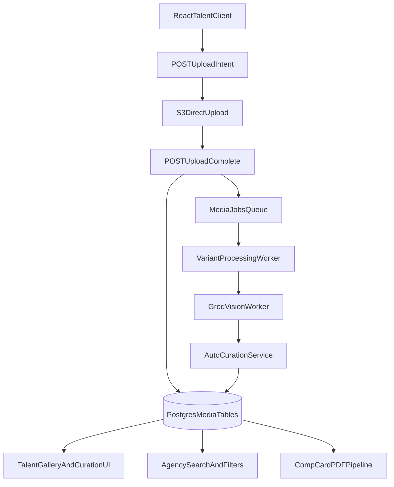

# Talent Media Management System (Implementation Spec)

## Objective

Design and implement a unified image/media system for talent portfolios in Pholio that supports:

- direct-to-S3 uploads with server validation
- processing + AI analysis pipeline
- manual and AI-assisted sorting/curation
- comp card generation from curated media
- agency-side search/filter by media metadata
- migration away from legacy `images` + `profile_photos`

---

## Architecture Overview



---

## Database Schema (Unified)

### 1) `media_assets`

Canonical media record per uploaded file.

- `id uuid primary key default gen_random_uuid()`
- `profile_id uuid not null references profiles(id) on delete cascade`
- `uploaded_by_user_id uuid not null references users(id) on delete cascade`
- `storage_provider text not null default 's3'`
- `storage_key text not null unique`
- `public_url text`
- `mime_type text not null`
- `bytes integer not null`
- `width integer`
- `height integer`
- `aspect_ratio numeric(8,4)`
- `orientation text` (`portrait|landscape|square|unknown`)
- `status text not null default 'uploaded'` (`uploaded|processing|processed|failed|archived`)
- `ai_status text not null default 'pending'` (`pending|running|complete|failed`)
- `sort_order integer not null default 0`
- `is_primary boolean not null default false`
- `manual_featured boolean not null default false`
- `source text not null default 'talent_upload'` (`talent_upload|agency_import|migration`)
- `deleted_at timestamp`
- `created_at timestamp default now()`
- `updated_at timestamp default now()`

Indexes:

- `(profile_id, deleted_at, sort_order)`
- `(profile_id, manual_featured)`
- `(profile_id, is_primary)`
- `(status)`
- `(ai_status)`

---

### 2) `media_variants`

Generated renditions for each asset.

- `id uuid primary key default gen_random_uuid()`
- `asset_id uuid not null references media_assets(id) on delete cascade`
- `variant_type text not null` (`original|thumb|web|compcard|retina`)
- `storage_key text not null unique`
- `public_url text`
- `mime_type text`
- `bytes integer`
- `width integer`
- `height integer`
- `created_at timestamp default now()`
- `updated_at timestamp default now()`

Constraints:

- unique `(asset_id, variant_type)`

Indexes:

- `(asset_id, variant_type)`

---

### 3) `media_ai_analysis`

AI-derived metadata for search and curation.

- `id uuid primary key default gen_random_uuid()`
- `asset_id uuid not null unique references media_assets(id) on delete cascade`
- `model_provider text not null default 'groq'`
- `model_name text`
- `model_version text`
- `quality_score numeric(5,2)`
- `compcard_score numeric(5,2)`
- `lighting_score numeric(5,2)`
- `sharpness_score numeric(5,2)`
- `background_cleanliness_score numeric(5,2)`
- `face_visibility_score numeric(5,2)`
- `pose_type text` (`headshot|half_body|full_body|editorial|unknown`)
- `shot_type text` (`studio|lifestyle|runway|beauty|unknown`)
- `hair_visibility text` (`clear|partial|obscured|unknown`)
- `dominant_color text`
- `safety_flags jsonb`
- `tags_json jsonb`
- `raw_json jsonb`
- `embedding vector(512)` (Postgres pgvector only)
- `analyzed_at timestamp`
- `created_at timestamp default now()`
- `updated_at timestamp default now()`

Indexes:

- `(quality_score)`
- `(compcard_score)`
- `(pose_type)`
- `(shot_type)`
- `(hair_visibility)`
- hnsw index on `embedding vector_cosine_ops`

---

### 4) `media_tags`

Tag dictionary.

- `id uuid primary key default gen_random_uuid()`
- `name text not null`
- `category text not null` (`look|pose|style|usage|custom`)
- `is_system boolean not null default false`
- `created_at timestamp default now()`

Constraints:

- unique `(name, category)`

---

### 5) `media_asset_tags`

Many-to-many mapping of assets to tags.

- `asset_id uuid not null references media_assets(id) on delete cascade`
- `tag_id uuid not null references media_tags(id) on delete cascade`
- `source text not null` (`manual|ai`)
- `confidence numeric(5,2)`
- `created_at timestamp default now()`

Constraints:

- primary key `(asset_id, tag_id, source)`

Indexes:

- `(tag_id, source)`
- `(asset_id, source)`

---

### 6) `media_collections`

Named sets for gallery and comp card curation.

- `id uuid primary key default gen_random_uuid()`
- `profile_id uuid not null references profiles(id) on delete cascade`
- `collection_type text not null` (`gallery|comp_card`)
- `name text`
- `created_at timestamp default now()`
- `updated_at timestamp default now()`

Constraints:

- unique `(profile_id, collection_type)`

---

### 7) `media_collection_items`

Ordered items inside a collection.

- `collection_id uuid not null references media_collections(id) on delete cascade`
- `asset_id uuid not null references media_assets(id) on delete cascade`
- `position integer not null`
- `pinned boolean not null default false`
- `created_at timestamp default now()`

Constraints:

- primary key `(collection_id, asset_id)`
- unique `(collection_id, position)`

---

## Legacy Consolidation Plan

Legacy tables:

- `images`
- `profile_photos`

Migration approach:

1. Create unified tables.
2. Backfill legacy media into `media_assets` + `media_variants`.
3. Preserve legacy `images.id` mapping in `media_assets.source='migration'` and optional `legacy_image_id` temp column during migration.
4. Dual-write API responses for one release if needed.
5. Switch reads to unified tables.
6. Remove dual-write.
7. Drop legacy tables in a final cleanup migration.

---

## Knex Migration Set

### Migration A: `create_unified_media_tables`

- Create:
  - `media_assets`
  - `media_variants`
  - `media_ai_analysis`
  - `media_tags`
  - `media_asset_tags`
  - `media_collections`
  - `media_collection_items`
- Add pgvector extension check + index creation (Postgres only).

### Migration B: `backfill_media_from_legacy_tables`

- Read all rows from `images` + `profile_photos`.
- Insert normalized records into `media_assets`.
- Insert default `original` variant into `media_variants` if source URL exists.
- For each profile, create default `gallery` and `comp_card` collections.
- Populate `media_collection_items` based on legacy sort and primary markers.

### Migration C: `switch_profile_primary_media_reference`

- If needed, add `profiles.primary_media_asset_id` FK to `media_assets`.
- Backfill from legacy hero/primary fields.

### Migration D: `drop_legacy_media_tables`

- Drop `profile_photos`.
- Drop `images`.
- Remove obsolete columns from `profiles` (`hero_image_path`, `photo_url_primary`, `photo_key_primary`) if still present and fully replaced.

---

## API Contract (Backend)

Base: `/api/talent/media`

### 1) `POST /upload-intents`

Request:

```json
{
  "files": [
    { "filename": "look1.jpg", "mimeType": "image/jpeg", "bytes": 2838172 }
  ]
}
```

Response:

```json
{
  "success": true,
  "data": {
    "items": [
      {
        "assetId": "uuid",
        "storageKey": "profiles/{profileId}/assets/{assetId}/original.jpg",
        "uploadUrl": "https://s3-presigned-url",
        "headers": { "Content-Type": "image/jpeg" },
        "maxBytes": 15728640
      }
    ]
  }
}
```

Validation:

- free tier file cap + monthly cap
- mime whitelist: `image/jpeg,image/png,image/webp`
- max bytes per file

---

### 2) `POST /complete`

Request:

```json
{
  "assetId": "uuid",
  "storageKey": "profiles/.../original.jpg",
  "mimeType": "image/jpeg",
  "bytes": 2838172
}
```

Behavior:

- verify S3 object exists (HEAD)
- insert/update `media_assets`
- enqueue `media.process` job

Response:

```json
{
  "success": true,
  "data": { "assetId": "uuid", "status": "processing" }
}
```

---

### 3) `GET /`

Query:

- `include=variants,ai,tags`
- `limit`, `cursor`

Response:

- list of assets sorted by `sort_order asc, created_at asc`

---

### 4) `PATCH /:assetId`

Request examples:

```json
{
  "manualFeatured": true,
  "isPrimary": false,
  "tagNames": ["headshot", "editorial"],
  "removeTagNames": ["lifestyle"]
}
```

Behavior:

- update manual flags
- apply manual tags in `media_asset_tags`

---

### 5) `POST /reorder`

Request:

```json
{
  "items": [
    { "assetId": "uuid-a", "sortOrder": 0 },
    { "assetId": "uuid-b", "sortOrder": 1 }
  ]
}
```

Behavior:

- transactionally update `media_assets.sort_order`
- if comp card collection is in manual mode, optionally mirror positions

---

### 6) `POST /:assetId/reanalyze`

Behavior:

- set `ai_status='pending'`
- enqueue AI re-analysis

---

### 7) `GET /comp-card/suggestions`

Response:

```json
{
  "success": true,
  "data": {
    "slots": [
      { "slot": "hero", "assetId": "uuid", "score": 92.4, "reason": "clean headshot + high sharpness" },
      { "slot": "full_body", "assetId": "uuid", "score": 88.1, "reason": "clear full silhouette" }
    ]
  }
}
```

---

### 8) `PUT /comp-card/selection`

Request:

```json
{
  "items": [
    { "assetId": "uuid-1", "position": 0, "pinned": true },
    { "assetId": "uuid-2", "position": 1, "pinned": false }
  ]
}
```

Behavior:

- upsert `media_collection_items` for collection type `comp_card`

---

## Queue & Worker Jobs

### Queue Names

- `media.process`
- `media.ai.analyze`
- `media.compcard.rank`

### Job: `media.process`

Input: `assetId`

Steps:

1. fetch original from S3
2. generate variants (`thumb`, `web`, `compcard`)
3. upload variants
4. update `media_variants` + dimensions on `media_assets`
5. enqueue `media.ai.analyze`

### Job: `media.ai.analyze`

Input: `assetId`

Steps:

1. send `compcard` variant to Groq Vision
2. parse structured output
3. write `media_ai_analysis`
4. upsert AI tags
5. set `media_assets.ai_status='complete'`
6. enqueue `media.compcard.rank`

### Job: `media.compcard.rank`

Input: `profileId`

Steps:

1. load processed assets + AI scores
2. calculate weighted score
3. update suggestion cache (or compute on request)
4. if no manual curation exists, auto-fill `comp_card` collection

---

## Sorting & Curation Rules

### Gallery Order

- Always `media_assets.sort_order`.

### Comp Card Selection Priority

1. pinned manual items in `comp_card` collection
2. manual non-pinned ordered items
3. highest AI `compcard_score`

### AI Scoring Formula (v1)

- `compcard_score =`
  - `0.30 * quality_score`
  - `0.20 * sharpness_score`
  - `0.15 * face_visibility_score`
  - `0.15 * background_cleanliness_score`
  - `0.20 * pose_slot_fit_score`

Store component scores in `raw_json` for explainability.

---

## Frontend Implementation (React)

### Components

- `MediaUploader`
  - drag/drop, multi-file queue, upload progress, retry
- `MediaGalleryGrid`
  - sortable tiles, infinite scroll, bulk actions
- `MediaAssetCard`
  - thumbnail, tags, AI badge, featured toggle
- `MediaMetadataDrawer`
  - manual tags + AI metadata inspector
- `CompCardCurationPanel`
  - slot-based selection with AI suggestions + pinning

### React Query Keys

- `['media-assets', profileId]`
- `['media-compcard-suggestions', profileId]`
- `['media-compcard-selection', profileId]`

### Client API Module

Add `client/src/api/media.js` with methods:

- `createUploadIntents`
- `completeUpload`
- `listMediaAssets`
- `updateMediaAsset`
- `reorderMediaAssets`
- `reanalyzeMediaAsset`
- `getCompCardSuggestions`
- `saveCompCardSelection`

---

## Backend Service Modules

Create in `src/lib/media/`:

- `storage.js` (S3 presign/head/delete)
- `repository.js` (Knex access layer)
- `processing.js` (Sharp variants)
- `ai.js` (Groq Vision + embedding parse)
- `curation.js` (ranking + selection)
- `validators.js` (tier/mime/size limits)

Routes in `src/routes/talent/media.api.js`.

---

## Security, Limits, and Validation

- enforce ownership by `profile_id` from session user
- signed URL expiry: 5-10 minutes
- checksum verification on completion
- strict mime and max byte limits
- rate limit upload-intent and complete endpoints
- sanitize tags and user-provided metadata
- soft-delete assets before hard purge

---

## Rollout Plan

### Phase 1: Foundation

- schema migration A
- API scaffolding + upload flow
- gallery reads from `media_assets`

### Phase 2: Processing + AI

- queue workers
- AI analysis persistence
- metadata/tag UI

### Phase 3: Comp Card Curation

- suggestion endpoint + panel
- pin/manual override flow

### Phase 4: Legacy Cutover

- backfill migration B
- switch all reads/writes
- drop legacy tables migration D

---

## Acceptance Criteria

- Uploads succeed end-to-end with direct S3 and DB records.
- Reordering persists and reflects immediately in gallery.
- Manual tags and AI tags coexist and are filterable.
- Comp card can be generated from curated set with deterministic order.
- Agency-side queries can filter by AI metadata and manual tags.
- No runtime dependency on legacy `images` or `profile_photos`.

