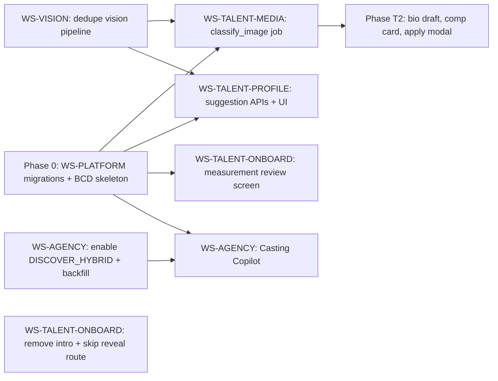
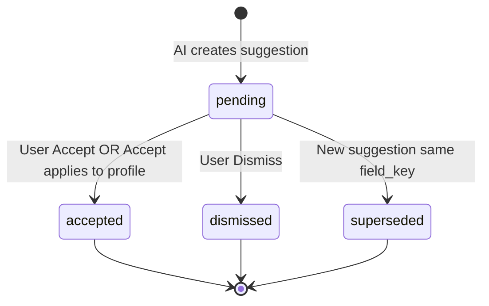

# Pholio Casting Intelligence Platform — Design Spec (Multi-Developer)

**Date:** 2026-06-08  
**Version:** 1.1  
**Status:** Approved for phased implementation  
**Scope:** Platform-wide AI — agency Discover, talent Intelligent Profile, shared BCD infrastructure  
**Audience:** Backend, frontend, and full-stack engineers working in parallel  

**Related specs:**  
- [`2026-04-16-talent-dashboard-redesign.md`](./2026-04-16-talent-dashboard-redesign.md) (visual tokens)  
- [`2026-06-07-agency-interviews-tab-design.md`](./2026-06-07-agency-interviews-tab-design.md) (agency UI patterns)  

---

## Document map (read this first)

| Section | Who needs it |
|---------|--------------|
| §1–2 Purpose & principles | Everyone |
| §3 Workstreams & ownership | Tech lead, all devs |
| §4 Dependency graph & sequencing | Tech lead |
| §5 Platform: BCD, jobs, events | **WS-PLATFORM** owner |
| §6 Data model & field registry | **WS-PLATFORM** + consumers |
| §7 API contracts | Backend + frontend integrators |
| §8 Agency: Discover & Copilot | **WS-AGENCY** owner |
| §9 Talent: Intelligent Profile | **WS-TALENT-PROFILE** owner |
| §10 Talent: Media & classification | **WS-TALENT-MEDIA** owner |
| §11 Talent: Onboarding & Overview | **WS-TALENT-ONBOARD** owner |
| §12 Notifications & activity | **WS-TALENT-PROFILE** + platform |
| §13 Testing matrix | QA / each WS owner |
| §14 Env, flags, cost | DevOps / tech lead |
| §15 Phase tickets & acceptance criteria | PM / all devs |

---

## 1. Purpose

Pholio is a **Casting Intelligence Platform**:

- **Agencies** search and cast in natural language (compositional queries, brief matching).
- **Talent** maintain profiles with **manual control**; AI runs asynchronously and surfaces **suggestions** inside the existing Profile form.

### North star metrics

| Audience | Metric | How measured |
|----------|--------|--------------|
| Agency | Compositional Discover queries return relevant talent | `scripts/eval-discover-quality.js` ≥ 8/11 PASS |
| Talent | Minimal form sessions to submission-ready | Median pending suggestions accepted ≤ 3 taps; onboarding → dashboard without radar |
| Platform | AI spend at launch scale | < $20/mo (500 profiles, 20 agencies, 500 searches/mo) |

---

## 2. Product principles (non-negotiable)

### 2.1 Manual control first

- Nothing sensitive writes to `profiles` without **Accept** or explicit **Save** on the form.
- Profile form (`ProfilePage`) stays primary; suggestions are auxiliary UI.
- Discover: intent filters are **soft boosts** in hybrid mode; explicit query params remain hard gates.

### 2.2 Suggestion vs draft vs notification

| Artifact | Storage | User action |
|----------|---------|-------------|
| **Suggestion** | `profile_suggestions` row, `status=pending` | Accept → copy to profile + mark accepted; Dismiss → mark dismissed |
| **Draft** | `profiles.bio_raw` / notification metadata only until saved | User clicks Save on bio field |
| **Notification** | `notifications` table | Tap → deep link; does not mutate profile |

### 2.3 Reveal / archetype radar — deprioritized

- **Do not** build dashboard UX around `CastingRevealRadar`, fit score rings, or `/reveal`.
- Fit scores may persist server-side for Discover indexing only.
- Onboarding completion navigates to **`/dashboard/talent/overview`**, not `/reveal`.

### 2.4 Intro Reel — removed from dashboard

- Remove Intro Reel cards from `OverviewPage` and `OverviewView`.
- Keep optional `video_reel_url` in Profile → Social only.

---

## 3. Workstreams & file ownership

Split work to minimize merge conflicts. **Do not edit another workstream’s files without coordination.**

| ID | Name | Owns (primary) | Does NOT own |
|----|------|----------------|--------------|
| **WS-PLATFORM** | Shared AI infrastructure | `src/domains/talent/services/background-casting-director.js`, `src/domains/talent/services/ai-job-runner.js`, `src/domains/talent/lib/talent-events.js`, `migrations/*profile_suggestions*`, `migrations/*ai_jobs*`, `src/shared/services/notifications.js` (new types only), `src/config.js` | Profile UI, Discover UI, media UI |
| **WS-AGENCY** | Agency Discover + Copilot | `src/domains/agency/services/discover-*.js`, `src/domains/agency/services/brief-matching.js` (new), `src/domains/agency/routes/casting.js` (copilot endpoints), `client/src/domains/agency/pages/DiscoverPage.jsx`, casting copilot UI | BCD, profile suggestions |
| **WS-TALENT-PROFILE** | Intelligent Profile form | `client/src/domains/talent/pages/ProfilePage/**`, `ProfileSuggestionsPanel.jsx` (new), `ProfileFieldSuggestion.jsx` (new), `src/domains/talent/routes/profile.js` (suggestion APIs), `src/domains/talent/routes/suggestions.js` (new) | Media upload routes, onboarding pages |
| **WS-TALENT-MEDIA** | Classification & curation | `src/domains/talent/routes/media.js`, `src/domains/ai/classify-image.js` (new), `client/.../MediaWorkspace.jsx`, `FrameEditor.jsx`, `CurationGuidance.jsx`, `portfolioGapAnalysis.js` integration | Profile form fields |
| **WS-TALENT-ONBOARD** | Onboarding + Overview | `client/src/domains/onboarding/**`, `src/domains/onboarding/routes/casting.js`, `OverviewPage`, `OverviewView`, `RecentActivity.jsx`, `App.jsx` (reveal routes) | BCD core, suggestion service |
| **WS-VISION** | Vision pipeline consolidation | `src/domains/ai/analyzeProfileImage.js`, `src/domains/ai/groq-casting.js`, `src/domains/ai/embeddings.js` (`buildTalentDocument`) | UI |

**Shared read-only for all:** `src/domains/ai/embeddings.js` (coordinate with WS-PLATFORM for `reindexDiscoverProfile` calls).

---

## 4. Dependency graph & sequencing



### Parallel safe (after Phase 0 migrations land)

- WS-AGENCY Discover enablement (no BCD dependency)
- WS-TALENT-ONBOARD Intro removal + route change (no BCD dependency)
- WS-VISION dedupe (feeds T1 but independent PR)

### Must be sequential

1. **Migrations** (`profile_suggestions`, `ai_jobs`) before any BCD job writes.
2. **BCD + `emitTalentEvent`** before media/profile hooks enqueue jobs.
3. **Suggestion APIs** before Profile UI Accept buttons.
4. **classify_image job** before Media UI “unconfirmed tag” badges.

---

## 5. Platform: Background Casting Director (BCD)

### 5.1 Module layout (WS-PLATFORM)

```
src/domains/talent/
  lib/
    talent-events.js          # emitTalentEvent(name, payload)
  services/
    background-casting-director.js   # enqueueForEvent(event)
    ai-job-runner.js               # processNextJobs(), processJob(job)
    suggestion-writer.js             # vision/classification → profile_suggestions rows
    suggestion-applier.js            # accept/dismiss logic
  routes/
    suggestions.js                 # REST (or mount under profile.js)
```

### 5.2 Event emitter

```javascript
// talent-events.js
const EVENTS = {
  IMAGE_UPLOADED: 'image.uploaded',
  IMAGE_PRIMARY_CHANGED: 'image.primary_changed',
  PROFILE_SAVED: 'profile.saved',
  ONBOARDING_SCOUT_CONFIRMED: 'onboarding.scout_confirmed',
  ONBOARDING_COMPLETED: 'onboarding.completed',
};

async function emitTalentEvent(knex, eventName, payload) {
  // 1. Map event → job types (see §5.4)
  // 2. Insert ai_jobs rows (idempotent via dedupe_key)
  // 3. Optionally trigger immediate processNextJobs() in dev
}
```

**Call sites (WS-* owners add one line each):**

| Event | File | Hook location |
|-------|------|---------------|
| `image.uploaded` | `src/domains/talent/routes/media.js` | After successful insert + processImage |
| `image.primary_changed` | `src/domains/talent/routes/media.js` + `profile.js` | When `is_primary` set |
| `profile.saved` | `src/domains/talent/routes/profile.js` | After successful update (debounced) |
| `onboarding.scout_confirmed` | `src/domains/onboarding/routes/casting.js` | After scout/confirm |
| `onboarding.completed` | `src/domains/onboarding/routes/casting.js` | When `onboarding_completed_at` set |

### 5.3 Job processor

```javascript
// ai-job-runner.js — processJob(job)
switch (job.job_type) {
  case 'classify_image':      → classifyImageJob(knex, payload)
  case 'vision_analysis':   → runVisionIfNeeded(knex, payload)  // WS-VISION
  case 'map_vision_suggestions': → suggestionWriter.fromVision(knex, profileId)
  case 'reindex_discover':    → reindexDiscoverProfile(knex, profileId)
  case 'bio_draft':           → bioDraftJob(knex, profileId)
  case 'comp_card_generate':  → compCardJob(knex, profileId)
}
```

**Concurrency rules:**

- Max **1 running job per profile_id** (skip enqueue if another `running` for same profile).
- `reindex_discover`: coalesce — if queued job exists for same profile, update payload timestamp instead of inserting duplicate.
- Failed jobs: `attempts++`; retry max **3** with exponential backoff (1m, 5m, 15m); then `status=failed`, log error.

**Dev execution:** `setInterval` every 5s in `src/app.js` when `AI_JOB_POLLER=true` (document in `.env.example`). Production: same poller or cron hitting `POST /api/internal/ai-jobs/process` (internal auth TBD).

### 5.4 Event → job mapping

| Event | Jobs enqueued | `dedupe_key` pattern |
|-------|---------------|----------------------|
| `image.uploaded` | `classify_image` | `classify:{imageId}` |
| `image.uploaded` (if is_primary) | `vision_analysis` | `vision:{profileId}` |
| `image.primary_changed` | `vision_analysis`, `reindex_discover` | `vision:{profileId}` |
| `profile.saved` | `reindex_discover` (debounce 30s) | `reindex:{profileId}` |
| `onboarding.scout_confirmed` | `vision_analysis`, `map_vision_suggestions`, `reindex_discover` | per above |
| `onboarding.completed` | `bio_draft`, `comp_card_generate`, `reindex_discover` | `bio_draft:{profileId}` etc. |

### 5.5 Idempotency

- `ai_jobs.dedupe_key` UNIQUE nullable — second enqueue with same key updates `payload` and resets to `queued` if `failed`.
- `profile_suggestions`: one pending row per `(profile_id, field_key)` — upsert on new suggestion.

---

## 6. Data model (detailed)

### 6.1 Migration: `20260608140000_create_ai_intelligence_tables.js`

**Owner:** WS-PLATFORM  
**Must merge before any BCD consumer PR.**

#### `profile_suggestions`

| Column | Type | Notes |
|--------|------|-------|
| `id` | UUID PK | |
| `profile_id` | UUID FK → profiles ON DELETE CASCADE | |
| `field_key` | VARCHAR(100) | See §6.3 registry |
| `suggested_value` | TEXT | JSON string for non-scalars |
| `current_value` | TEXT NULL | Snapshot at suggestion time (conflict detection) |
| `source` | VARCHAR(50) | `vision`, `classification`, `bio_writer`, `oauth`, `manual` |
| `confidence` | REAL NULL | 0–1 |
| `status` | VARCHAR(20) | `pending`, `accepted`, `dismissed`, `superseded` |
| `metadata` | TEXT/JSONB | `{ imageId, analysisModel, reason }` |
| `created_at`, `updated_at` | TIMESTAMP | |

**Indexes:**

- `(profile_id, status)` — list pending
- Unique partial: `(profile_id, field_key) WHERE status = 'pending'` (PG); SQLite emulate in app layer

#### `ai_jobs`

| Column | Type | Notes |
|--------|------|-------|
| `id` | UUID PK | |
| `profile_id` | UUID NULL FK | |
| `agency_id` | UUID NULL | future agency jobs |
| `job_type` | VARCHAR(50) | |
| `payload` | TEXT/JSONB | |
| `dedupe_key` | VARCHAR(200) NULL UNIQUE | |
| `status` | VARCHAR(20) | `queued`, `running`, `done`, `failed` |
| `attempts` | INT DEFAULT 0 | |
| `error` | TEXT NULL | |
| `run_after` | TIMESTAMP NULL | backoff |
| `created_at`, `started_at`, `completed_at` | TIMESTAMP | |

#### `brief_embeddings` (WS-AGENCY — extend usage, no schema change)

Use `metadata` JSON: `{ board_id, agency_id, title }`. `brief_id` = `board_id` until dedicated briefs table exists.

### 6.2 Suggestion state machine



**Rules:**

- Accept: write `suggested_value` → profile column(s); set `status=accepted`; emit `reindex_discover` job.
- Dismiss: `status=dismissed` only; never write profile.
- New suggestion for same `field_key`: mark old `pending` → `superseded`.
- If `current_value` on profile changed since suggestion created: show **conflict UI** (Accept anyway | Dismiss).

### 6.3 `field_key` registry

**Owner:** WS-PLATFORM defines; all writers MUST use these keys.

| field_key | Profile target | Value type | Writers |
|-----------|----------------|------------|---------|
| `height_cm` | `profiles.height_cm` | number | vision |
| `weight_kg` | `profiles.weight_kg` | number | vision |
| `bust_cm` | `profiles.bust_cm` | number | vision |
| `waist_cm` | `profiles.waist_cm` | number | vision |
| `hips_cm` | `profiles.hips_cm` | number | vision |
| `skin_tone` | `profiles.skin_tone` | string | vision |
| `body_type` | `profiles.body_type` | string | vision |
| `specialties` | `profiles.specialties` | JSON array merge | vision |
| `bio_curated` | `profiles.bio_curated` | string (draft) | bio_writer |
| `image:{uuid}:shot_type` | `images.shot_type` via metadata | enum | classification |
| `image:{uuid}:style_type` | `images.style_type` | enum | classification |
| `image:{uuid}:image_type` | `images.image_type` | enum | classification |
| `image:{uuid}:comp_role` | image metadata | string | classification |

**Never suggest via this system:** `first_name`, `last_name`, `date_of_birth`, `ethnicity` (identity — manual only; optional future `ethnicity` suggest requires explicit product approval).

### 6.4 User edit tracking

Add optional column `profiles.field_provenance` (JSONB/TEXT) — **Phase T1 optional**:

```json
{
  "height_cm": { "source": "user", "at": "2026-06-08T..." },
  "skin_tone": { "source": "ai_suggestion", "suggestionId": "...", "at": "..." }
}
```

If omitted at launch: conflict detection uses `current_value` snapshot on suggestion row only.

---

## 7. API contracts

### 7.1 Talent suggestions (WS-TALENT-PROFILE + WS-PLATFORM)

Base: `/api/talent` — session auth, role TALENT.

#### `GET /api/talent/suggestions`

Query: `?status=pending` (default pending only)

**Response 200:**

```json
{
  "success": true,
  "data": {
    "suggestions": [
      {
        "id": "uuid",
        "fieldKey": "height_cm",
        "suggestedValue": 178,
        "currentValue": null,
        "source": "vision",
        "confidence": 0.82,
        "status": "pending",
        "label": "Height",
        "displayValue": "178 cm",
        "sectionTab": "appearance",
        "hasConflict": false,
        "metadata": { "imageId": null },
        "createdAt": "ISO8601"
      }
    ],
    "pendingCount": 3
  }
}
```

Server maps `field_key` → `label`, `sectionTab` via `src/domains/talent/lib/suggestion-field-map.js` (new).

#### `POST /api/talent/suggestions/:id/accept`

**Response 200:** `{ success: true, data: { profile: {...partial}, suggestion: { status: 'accepted' } } }`

**Errors:**

- `409` — conflict and client did not send `{ force: true }`
- `404` — not found or not owned

#### `POST /api/talent/suggestions/:id/dismiss`

**Response 200:** `{ success: true }`

#### `POST /api/talent/suggestions/accept-all`

Body: `{ "fieldKeys": ["height_cm", "skin_tone"] }` optional; default all pending without conflict.

**Response 200:** `{ success: true, data: { accepted: 2, skipped: 1, conflicts: [...] } }`

### 7.2 Talent profile (existing — extend)

`GET /api/talent/profile` response adds:

```json
{
  "pendingSuggestionCount": 3,
  "aiProcessing": {
    "visionComplete": true,
    "lastIndexedAt": "ISO8601"
  }
}
```

### 7.3 Notifications (WS-PLATFORM extends `src/shared/services/notifications.js`)

Add to `NOTIFICATION_TYPES`:

| Constant | type string |
|----------|-------------|
| `AI_SUGGESTIONS_READY` | `ai_suggestions_ready` |
| `AI_CLASSIFICATION_REVIEW` | `ai_classification_review` |
| `AI_BIO_DRAFT_READY` | `ai_bio_draft_ready` |
| `AI_COMP_CARD_READY` | `ai_comp_card_ready` |

Helper functions:

```javascript
async function notifyTalentAiSuggestionsReady({ userId, count }) {
  return upsertUserNotification({
    userId,
    type: NOTIFICATION_TYPES.AI_SUGGESTIONS_READY,
    title: count === 1 ? '1 profile suggestion ready' : `${count} profile suggestions ready`,
    body: 'Review AI suggestions and accept what looks right.',
    routeTarget: '/dashboard/talent/profile?tab=identity&suggestions=1',
    groupKey: `ai_suggestions:${userId}`,
    metadata: { count },
    reopenOnRepeat: true,
  });
}
```

**Frontend:** extend `client/src/shared/components/NotificationCenter/notificationHelpers.js` — `TYPE_VISUAL`, `getNotificationCategory`, filter tab `alerts`.

### 7.4 Agency Discover (existing — WS-AGENCY)

`GET /api/agency/discover?q=&limit=30`

Document for integrators — response shape:

```json
{
  "profiles": [{
    "id": "uuid",
    "first_name": "...",
    "match_score": 85,
    "match_breakdown": { "rerank": 85, "rrf": 72, "legs": { "visual": 0.4, "casting": 0.8 } },
    "match_rationale": "Strong editorial bone structure...",
    "vibe_distance": null
  }],
  "pagination": { "page": 1, "limit": 30, "total": 12, "totalPages": 1 },
  "meta": {
    "semantic_search": true,
    "hybrid_search": true,
    "query_understanding": { "attributes": [...], "constraints": [...] },
    "retrieval": { "legs_used": ["dense_casting", "lexical"], "candidates_before_rerank": 50 },
    "fusion": "rrf",
    "rerank_provider": "groq"
  }
}
```

Legacy (hybrid off): `match_score` may be absent; `vibe_distance` present.

### 7.5 Agency Casting Copilot (Phase A2 — WS-AGENCY)

#### `POST /api/agency/boards/:boardId/copilot/match`

Body:

```json
{
  "briefText": "FW26 show — angular runway, 178cm+, editorial edge",
  "limit": 20
}
```

**Response:**

```json
{
  "success": true,
  "data": {
    "parsedBrief": { "attributes": [...], "constraints": [...] },
    "matches": [
      {
        "profileId": "uuid",
        "matchScore": 88,
        "rationale": "...",
        "alreadyOnBoard": false
      }
    ]
  }
}
```

Implementation: reuse `understandQuery(briefText)` + `retrieveAndFuse` scoped to discoverable talent; exclude already linked board applications.

---

## 8. Agency workstream (WS-AGENCY)

### 8.1 Phase 0 — Enable hybrid Discover

**Tasks:**

| ID | Task | Acceptance |
|----|------|------------|
| A-0.1 | Set `DISCOVER_HYBRID=true` in staging/prod env | Meta shows `hybrid_search: true` |
| A-0.2 | Run migrate + `node scripts/backfill-discover-index.js` | All channels populated per profile |
| A-0.3 | Add CI step: `npx jest tests/integration/agency-discover-search.test.js` | Green on PR |
| A-0.4 | Run `node scripts/eval-discover-quality.js` | Document baseline in PR |
| A-0.5 | Script: batch vision on discoverable profiles (uses WS-VISION) | visual channel non-empty |

**Files:** `.env.example`, `README.md` (Discover section), no talent files.

### 8.2 Phase A2 — Casting Copilot

**New files:**

- `src/domains/agency/services/brief-matching.js`
- `src/domains/agency/services/brief-embedder.js` — upsert `brief_embeddings` / SQLite cache analogue
- `client/src/domains/agency/components/BoardCopilotPanel.jsx`

**UI behavior:**

- Tab on board detail / casting panel: “AI Match”
- Textarea pre-filled with board name + client notes
- Results list: talent row + score + rationale + [Add to board]
- **No auto-add** — agency clicks Add (manual control)

### 8.3 Phase A4 — Outcome logging

**New table (optional):** `discover_outcome_events (id, agency_id, profile_id, event_type, board_id, created_at)`

Event types: `shortlisted`, `booked`, `declined`, `discover_click`, `discover_invite`.

Emit from existing application/board status handlers — **do not block** main request.

---

## 9. Talent Profile workstream (WS-TALENT-PROFILE)

### 9.1 UI components (new)

#### `ProfileSuggestionsPanel.jsx`

**Location:** `client/src/domains/talent/components/ProfileSuggestionsPanel.jsx`

**Props:** `suggestions`, `onAccept`, `onDismiss`, `onAcceptAll`, `isLoading`

**Placement:** Top of Profile page (below nav), collapsible; also opens when `?suggestions=1` query param.

**Visual:** Match agency design tokens (`--ag-gold` accent for AI); badge “Suggested by Pholio”.

#### `ProfileFieldSuggestion.jsx`

**Props:** `suggestion`, `onAccept`, `onDismiss`, `compact`

**Placement:** Inline above field in `MeasurementsSection`, `IdentitySection` (skin_tone only), etc.

**Conflict state:** Yellow border + “Your current value differs” + [Replace with suggestion] [Keep mine]

### 9.2 React Query hooks (new)

`client/src/domains/talent/hooks/useProfileSuggestions.js`

```javascript
useProfileSuggestions()        // GET pending
useAcceptSuggestion()          // POST accept
useDismissSuggestion()         // POST dismiss
useAcceptAllSuggestions()      // POST accept-all
```

Invalidate `['talent-profile']` and `['profile-suggestions']` on mutation.

### 9.3 Accept flow (server — `suggestion-applier.js`)

```javascript
async function acceptSuggestion(knex, profileId, suggestionId, { force = false }) {
  // 1. Load suggestion pending
  // 2. Load profile field — if changed && !force → throw ConflictError
  // 3. Apply value via field_key mapper
  // 4. Mark accepted
  // 5. enqueue reindex_discover
}
```

**Image field keys:** update `images` row metadata columns (`shot_type`, etc.) — confirm column names in `media.js` / images schema before implementing.

### 9.4 Empty-field-only rule

On suggestion **creation** (not accept):

```javascript
if (fieldKey.startsWith('image:')) { /* always suggest if different from classified */ }
else if (profile[field] != null && profile[field] !== '') {
  // still create suggestion but set metadata.requiresExplicitAccept = true
  // OR skip if user value exists — launch policy: SKIP (do not suggest over user data)
}
```

**Launch policy:** If profile field already has user-entered value, **do not create** suggestion (log `superseded` skip reason in job payload).

---

## 10. Talent Media workstream (WS-TALENT-MEDIA)

### 10.1 `classify-image.js` (new)

**Input:** `{ imageId, profileId, publicUrl | absolutePath }`

**Groq call:** `config.groq.visionModel` with JSON schema:

```json
{
  "shot_type": "headshot|full_body|three_quarter|profile|detail|other",
  "style_type": "editorial|commercial|beauty|lifestyle|runway|fitness|other",
  "image_type": "digital|polaroid|screen_test|other",
  "comp_card_role": "hero|grid_1|grid_2|grid_3|grid_4|none",
  "quality_score": 0-100,
  "coaching_note": "string max 120 chars",
  "confidence": 0-1
}
```

**Output actions:**

1. Write suggestions for `image:{id}:*` keys (confidence ≥ 0.6)
2. Store raw classification on `images.metadata` → `{ aiClassification, classifiedAt }`
3. If `confidence < 0.6` → enqueue notification `ai_classification_review`

### 10.2 Media UI changes

| File | Change |
|------|--------|
| `MediaWorkspace.jsx` | Badge on thumbnail if pending image suggestions |
| `FrameEditor.jsx` | Pre-fill from latest classification; show “AI suggested” chip |
| `CurationGuidance.jsx` | Mount on Media tab; pass classified shots into `portfolioGapAnalysis.js` |

**Mount point:** `PhotosTab.jsx` or `MediaWorkspace.jsx` top — WS-TALENT-MEDIA owns.

### 10.3 Duplicate detection (lightweight)

Compare new upload embedding or pHash — **Phase T1 optional** — skip if not ready; stub in job with `duplicate_of_image_id` in metadata.

---

## 11. Talent Onboarding & Overview (WS-TALENT-ONBOARD)

### 11.1 Remove Intro Reel

| File | Action |
|------|--------|
| `client/src/domains/talent/pages/OverviewPage/index.jsx` | Delete Intro Reel block (~lines 476–490) |
| `client/src/domains/talent/components/OverviewView.jsx` | Delete Intro Reel artifact (~lines 461–475) |
| Associated CSS | Remove `.ov-artifact-*` if orphaned |

**Acceptance:** Grep `Intro Reel` / `Intro reel` in `client/src/domains/talent` returns 0.

### 11.2 Skip Reveal route

| File | Change |
|------|--------|
| `client/src/domains/onboarding/pages/CastingCallPage.jsx` | Replace `navigate('/reveal')` → `navigate('/dashboard/talent/overview')` |
| `client/src/App.jsx` | Keep `/reveal` routes for dev preview but remove from post-onboarding flow; add comment `@deprecated` |
| `client/src/shared/components/Breadcrumbs.jsx` | Remove or hide `/reveal` |

**Server:** `POST /onboarding/reveal-complete` may still run in background from overview first-load or explicit API — **do not require radar UI**.

### 11.3 Measurement review screen

Replace `CastingMeasurements.jsx` 6-step wizard when `predictions.confidence !== 'Low'`:

**New component:** `CastingMeasurementReview.jsx`

- Single screen: all fields editable (height, weight, bust, waist, hips)
- Prefill from `onboarding_state_json.predictions`
- CTA: “Continue” → saves via existing `/measurements` API
- Low confidence: fall back to existing wizard OR same screen with empty fields

### 11.4 Non-blocking scout scan

`CastingScout.jsx`: on Continue, **do not block** on analysis complete. Copy: “Analyzing your photos — you can continue setup.”

### 11.5 Overview activity feed

**Replace mock in** `RecentActivity.jsx`:

**New API:** `GET /api/talent/activity?limit=20` (WS-TALENT-ONBOARD + WS-PLATFORM)

Sources merged:

- Recent `notifications` (last 7d)
- Last 5 `ai_jobs` completed for profile (status messages)
- Application status changes (existing data)

**No fit score / radar events.**

### 11.6 Overview readiness strip

Show: `pendingSuggestionCount` from profile API + existing readiness from `profileReadinessItems.js`.

Copy: “3 AI suggestions · 2 profile items incomplete” — links to Profile with `?suggestions=1`.

---

## 12. Vision consolidation (WS-VISION)

### 12.1 Single vision pipeline

**Problem:** `masterVisionAnalysis` + `groq-casting.runScout` analyze same photo twice.

**Target flow:**

1. `analyzeProfileImage.js` = **only** vision entrypoint for headshot/cover.
2. `groq-casting.generateArchetype()`:
   - Read `profiles.image_analysis` + primary image path
   - If missing, call `masterVisionAnalysis` once
   - Run Director on existing scout JSON derived from `image_analysis` (map fields) OR use cached `onboarding_signals.ai_results.scout`
3. Delete second Groq vision call in `runScout` when cache hit.

**Acceptance test:** Upload cover → one Groq vision API call logged (mock counter).

### 12.2 `buildTalentDocument()` (embeddings.js)

```javascript
function buildTalentDocument(profile, extras = {}) {
  // Concatenate: buildVisualIndexText + buildCastingIndexText + buildMarketIndexText
  // + classified image summary from images.metadata
  // Used internally; not exposed to talent UI
}
```

Called from `reindexDiscoverProfile` before channel upserts.

---

## 13. Testing matrix

| WS | Test file | What |
|----|-----------|------|
| PLATFORM | `tests/unit/suggestion-applier.test.js` | accept/dismiss/conflict |
| PLATFORM | `tests/unit/ai-job-runner.test.js` | dedupe, retry, coalesce |
| PLATFORM | `tests/integration/talent-suggestions.test.js` | HTTP accept flow |
| AGENCY | `tests/integration/agency-discover-search.test.js` | existing + eval script |
| AGENCY | `tests/integration/board-copilot.test.js` | Phase A2 |
| MEDIA | `tests/unit/classify-image.test.js` | mock Groq JSON parse |
| MEDIA | `tests/integration/media-classification.test.js` | upload → job → suggestion |
| ONBOARD | `client` e2e optional | onboarding → overview not /reveal |

**Groq mocking:** All integration tests mock `@groq-sdk` or inject `classifyImage` stub — **never hit live API in CI**.

**Regression:** Test that accepting suggestion does not overwrite when `force: false` and profile changed.

---

## 14. Environment variables

| Variable | Default | Owner |
|----------|---------|-------|
| `DISCOVER_HYBRID` | `false` | WS-AGENCY |
| `DISCOVER_RETRIEVAL_TOP_K` | `80` | WS-AGENCY |
| `DISCOVER_RERANK_TOP_K` | `50` | WS-AGENCY |
| `DISCOVER_RERANK_PROVIDER` | `groq` | WS-AGENCY |
| `DISCOVER_MIN_RERANK_SCORE` | `40` | WS-AGENCY |
| `DISCOVER_RRF_K` | `60` | WS-AGENCY |
| `OPENAI_API_KEY` | — | all embed paths |
| `GROQ_API_KEY` | — | vision + text |
| `GROQ_TEXT_MODEL` | `llama-3.3-70b-versatile` | config |
| `GROQ_VISION_MODEL` | `meta-llama/llama-4-scout-17b-16e-instruct` | config |
| `AI_JOB_POLLER` | `true` in dev | WS-PLATFORM |
| `AI_JOB_POLL_MS` | `5000` | WS-PLATFORM |
| `AI_VISION_DEBOUNCE_MS` | `30000` | WS-PLATFORM |

---

## 15. Phase tickets & acceptance criteria

### Phase 0 — Foundation (WS-PLATFORM + parallel)

| Ticket | Owner | Acceptance criteria |
|--------|-------|---------------------|
| P0-1 | PLATFORM | Migrations applied; tables exist on SQLite + PG |
| P0-2 | PLATFORM | `emitTalentEvent` + `ai-job-runner` processes `reindex_discover` |
| P0-3 | PLATFORM | Suggestion CRUD APIs return correct shapes |
| P0-4 | ONBOARD | Intro Reel removed; grep clean |
| P0-5 | ONBOARD | Onboarding → `/dashboard/talent/overview` |
| P0-6 | AGENCY | Hybrid Discover enabled in staging; eval script attached to PR |
| P0-7 | VISION | Single vision call per cover upload (logged test) |

### Phase T1 — Intelligent Profile core

| Ticket | Owner | Acceptance criteria |
|--------|-------|---------------------|
| T1-1 | MEDIA | Upload → `classify_image` job → pending image suggestions |
| T1-2 | PLATFORM | Vision → measurement/skin suggestions on scout confirm |
| T1-3 | PROFILE | Inline + panel UI; Accept updates profile |
| T1-4 | PROFILE | Dismiss does not mutate profile |
| T1-5 | MEDIA | CurationGuidance visible on Media tab |
| T1-6 | ONBOARD | Measurement review single screen (medium+ confidence) |
| T1-7 | ONBOARD | Activity feed uses real API |
| T1-8 | PLATFORM | Notification types wired in center UI |

### Phase A2 — Casting Copilot

| Ticket | Owner | Acceptance criteria |
|--------|-------|---------------------|
| A2-1 | AGENCY | POST copilot/match returns ranked list |
| A2-2 | AGENCY | brief_embeddings row created on board copilot run |
| A2-3 | AGENCY | UI Add to board works; no auto-add |

### Phase T2 — Depth

| Ticket | Owner | Acceptance criteria |
|--------|-------|---------------------|
| T2-1 | PLATFORM | bio_draft job + notification |
| T2-2 | MEDIA | comp_card_generate job + notification |
| T2-3 | PROFILE | Apply modal note draft (user edits before send) |
| T2-4 | ONBOARD | OAuth city signal wired in casting entry |

---

## 16. PR & code review checklist

- [ ] Does not edit files outside workstream ownership without note in PR description
- [ ] No auto-write to `profiles` without going through suggestion accept API
- [ ] Groq calls use `config.groq.*Model` — no hardcoded maverick
- [ ] New notification types added to backend + `notificationHelpers.js`
- [ ] `field_key` uses registry (§6.3)
- [ ] Integration tests mock external AI APIs
- [ ] No new emphasis on Reveal/radar/Intro Reel
- [ ] README or `.env.example` updated if new env vars

---

## 17. Non-goals (launch)

- Custom model fine-tuning; CLIP; 24/7 booking agent
- Replacing Profile form with inbox-only UX
- Archetype radar hero; Intro Reel dashboard surface
- Auto-apply without Accept
- GPT-4o as default

---

## 18. Open questions

1. Suggestion expiry (auto-dismiss after 30d)? — **Default: no expiry at launch**
2. Agency visibility into AI-assisted stats? — **Default: no**
3. Internal job processor auth for production? — **Defer; use poller on same dyno at launch**

---

## 19. Summary

Multi-developer delivery relies on **five workstreams** (Platform, Agency, Profile, Media, Onboarding) plus **Vision consolidation**, coordinated through **BCD events**, **`profile_suggestions`**, and documented **API contracts**. Talent keep manual control via Accept/Dismiss; agencies keep manual control via explicit board adds. Reveal radar and Intro Reel are out of scope for dashboard emphasis.

**Next step:** Each WS owner creates implementation plan PRs against Phase 0 tickets; tech lead merges migrations first.
