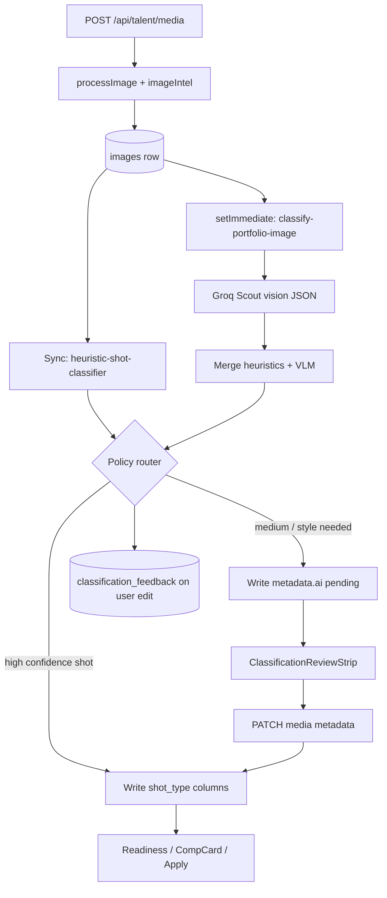

# Pholio Image Typing Service (PITS) — Design Spec

**Date:** 2026-06-22  
**Phase:** Production final (2026-06-24) — Package Intelligence foundation

---

## 1. Problem

Talent uploads photos without consistently tagging `shot_type`, `style_type`, or `image_type`. Downstream systems already depend on those columns:

- **Profile readiness** (`profile-readiness-images.js`) — requires headshot + full-body
- **Comp card intelligence** (`photo-intelligence.js`, `comp-card-selector.js`) — ranks hero/back story by role
- **Apply workspace** — submission package quality

Today uploads land as untyped frames; tagging is manual via `FrameEditor` / `ImageMetadataModal`. Casting analysis (`masterVisionAnalysis`) runs on the **primary headshot only** and writes to `profiles.image_analysis` — wrong granularity and schema for per-image typing.

**Goal:** After each upload, Pholio should understand what kind of photo it is, what's missing from an agency-ready digitals set, and which images suit comp cards — with human confirmation when uncertain.

---

## 2. Non-goals (v1)

- Training or hosting a custom classification model
- Replacing casting / market-fit analysis on the primary photo
- Agency-specific submission rule engines (industry-default matrix only)
- Blocking upload on classification latency
- New parallel tag systems (`metadata.tags` remains legacy; structured columns win)

---

## 3. Design principles

1. **Reuse before add** — Groq Scout (already integrated), `processImage` → `imageIntel`, `image-forensics.js`, optional `faces.js`
2. **Structured columns are canonical** — `shot_type`, `style_type`, `image_type` (existing enums in `validation.js`)
3. **Propose → confirm → commit** — auto-apply only at high confidence; user override always wins
4. **Separate concerns** — PITS ≠ `masterVisionAnalysis` (face/market) ≠ comp-card forensics (layout)
5. **Fail soft** — classification errors never fail upload; missing Groq key skips VLM tier only
6. **No banned UI** — plain text labels under frames, no corner chips, no pulsing status dots

---

## 4. Agency taxonomy (mapped to existing enums)

### 4.1 Dimensions

| Column | Values (existing) | Industry meaning |
|--------|-------------------|------------------|
| `shot_type` | `headshot`, `three_quarter`, `full_length`, `profile_left`, `profile_right`, `back`, `detail` | Framing / angle |
| `style_type` | `editorial`, `commercial`, `lifestyle`, `beauty`, `ecommerce`, `swimwear`, `fitness` | Market register (portfolio) |
| `image_type` | `digital`, `portfolio`, `comp_card`, `campaign`, `test` | Natural digitals vs styled book |

### 4.2 Digitals completeness matrix (readiness v2)

**Required (submission-ready tier — unchanged keys, stricter matching):**

| Slot | Match rule |
|------|------------|
| Headshot | `shot_type=headshot` AND (`image_type=digital` OR unset with natural styling signals) |
| Full body | `shot_type` ∈ `{full_length, three_quarter}` AND body-visible |

**Improve tier (agency-competitive — new readiness keys):**

| Slot key | Match rule |
|----------|------------|
| `photo_profile` | `shot_type` ∈ `{profile_left, profile_right}` |
| `photo_smile` | `shot_type=headshot` + `metadata.ai.signals.expression=smile` |
| `photo_back` | `shot_type=back` |
| `photo_editorial` | `style_type=editorial` + `image_type=portfolio` |
| `photo_lifestyle` | `style_type` ∈ `{lifestyle, commercial}` + `image_type=portfolio` |

Comp-card roles (`headshot`, `full_body`, `editorial`, `lifestyle`) continue to derive from shot/style via `deriveCompCardRole()` — no change.

### 4.3 Optional signal facets (metadata only, not new enums)

Stored at `metadata.ai.signals`:

```json
{
  "expression": "neutral | smile | serious",
  "pose_yaw": "front | three_quarter | profile_left | profile_right | back",
  "body_visibility": "face_only | bust | three_quarter | full_length",
  "background": "plain | studio | environmental",
  "styling_register": "natural | polished | editorial"
}
```

---

## 5. Architecture



### 5.1 Layer 1 — Signal extractor (sync, existing)

**Already runs in** `src/shared/lib/uploader.js`:

- Dimensions → aspect ratio
- `image-forensics.js` → background quietness, contrast, saturation
- Optional `perception/faces.js` → face bounding boxes (if `@vladmandic/human` + TFJS backend installed)

**New:** `src/domains/ai/heuristic-shot-classifier.js`

Pure functions, no ML. Inputs: `{ width, height, faces[], forensics }`. Outputs draft:

```javascript
{
  shot_type: "headshot" | "full_length" | "three_quarter" | "profile_left" | null,
  confidence: 0..1,
  signals: { body_visibility, pose_yaw estimate },
  reasons: string[]
}
```

Heuristic rules (deterministic):

| Condition | Draft `shot_type` |
|-----------|-------------------|
| Primary face area ≥ 12% of frame | `headshot` |
| Primary face area 5–12%, portrait aspect | `three_quarter` |
| Primary face area < 5%, aspect < 0.85, face in upper 35% | `full_length` |
| Face box touching lateral edge + narrow width/height | `profile_left` or `profile_right` (by x position) |
| No face detected, portrait, subject mass in center | `back` (low confidence) |
| Ambiguous | `null`, confidence < 0.5 |

Skip Groq when heuristic confidence ≥ **0.90** AND caller only needs `shot_type` for routing (still run Groq for `style_type` / `image_type` unless user already set them).

### 5.2 Layer 2 — Groq classifier (async, existing provider)

**New:** `src/domains/ai/classify-portfolio-image.js`

- Model: `meta-llama/llama-4-scout-17b-16e-instruct` (same as `analyzeProfileImage.js`)
- Pattern: fire-and-forget after upload; read buffer from `absolute_path` or R2
- `response_format: { type: "json_object" }`, temperature `0.1`
- Prompt includes: heuristic draft + forensics summary + **exact allowed enum lists** from `validation.js`
- Does **not** call `masterVisionAnalysis` or write to `profiles.image_analysis`

Output schema:

```json
{
  "shot_type": "full_length",
  "style_type": "commercial",
  "image_type": "digital",
  "confidence": {
    "shot_type": 0.91,
    "style_type": 0.72,
    "image_type": 0.88
  },
  "signals": {
    "expression": "neutral",
    "pose_yaw": "front",
    "body_visibility": "full_length",
    "background": "plain",
    "styling_register": "natural"
  },
  "reasoning": "One sentence.",
  "uncertainty_factors": []
}
```

Merge rule: if heuristic `shot_type` confidence > VLM `shot_type` confidence, prefer heuristic for shot only; VLM always wins for style/image_type when present.

### 5.3 Layer 3 — Policy router

**New:** `src/domains/talent/services/image-classification-policy.js`

```javascript
applyClassificationPolicy({
  imageRow,       // current DB row
  classification, // merged result
  userConfirmed,  // boolean
})
→ {
  columnUpdates: { shot_type?, style_type?, image_type? },
  metadataPatch: { ai: { classification: { ...provenance } } },
  band: 'auto' | 'suggest' | 'ask',
}
```

**Thresholds (initial — calibrate in P2):**

| Field | Auto-apply | Suggest | Ask |
|-------|------------|---------|-----|
| `shot_type` | ≥ 0.88 | 0.65–0.87 | < 0.65 |
| `style_type` | ≥ 0.80 | 0.55–0.79 | < 0.55 |
| `image_type` | ≥ 0.80 | 0.55–0.79 | < 0.55 |

**Escalation rules (always downgrade one band):**

- `uncertainty_factors.length >= 2`
- Top-2 shot labels within 0.15 confidence (when VLM returns alternates in metadata)
- User previously corrected this profile's same prediction pattern (optional P2)
- Column already set by user (`metadata.ai.classification.source === 'user'`) → never overwrite

**Provenance** (`metadata.ai.classification`):

```json
{
  "model": "meta-llama/llama-4-scout-17b-16e-instruct",
  "classified_at": "ISO8601",
  "source": "auto | suggested | user",
  "confirmed": false,
  "band": "auto | suggest | ask",
  "shot_type": { "value": "full_length", "confidence": 0.91 },
  "style_type": { "value": null, "confidence": 0.58 },
  "image_type": { "value": "digital", "confidence": 0.88 },
  "signals": {},
  "reasoning": "",
  "heuristic_reasons": []
}
```

### 5.4 Feedback table (calibration, not training)

**Migration:** `image_classification_feedback`

| Column | Type |
|--------|------|
| `id` | uuid PK |
| `image_id` | uuid FK → images |
| `profile_id` | uuid FK → profiles |
| `predicted_shot_type` | string nullable |
| `predicted_style_type` | string nullable |
| `predicted_image_type` | string nullable |
| `corrected_shot_type` | string nullable |
| `corrected_style_type` | string nullable |
| `corrected_image_type` | string nullable |
| `confidence_json` | jsonb/text |
| `model` | string |
| `created_at` | timestamp |

Insert when user saves `FrameEditor` / `ImageMetadataModal` and any predicted field differs from saved value.

---

## 6. API & upload integration

### 6.1 Upload hook (`src/domains/talent/routes/media.js`)

After successful `images.insert` inside existing transaction:

1. Sync: run heuristic classifier on `processed.imageIntel` + optional face detect on buffer (best-effort, non-blocking within request if < 200ms else defer faces to async path)
2. If heuristic band = auto for `shot_type` and columns null → apply within transaction optional (prefer async to keep upload fast — **v1: all column writes async** except metadata signals)
3. `setImmediate`: `runImageClassification(knex, imageId)` — full pipeline

Response adds per image:

```json
{
  "classification_status": "pending",
  "shot_type": null,
  "metadata": { "ai": { "classification": { "band": "pending" } } }
}
```

### 6.2 New endpoint (optional, P1)

`GET /api/talent/media/:id/classification` — returns latest `metadata.ai.classification` + current columns. Alternatively extend existing `GET /api/talent/media` list payload (preferred — no new route if list already returns metadata).

### 6.3 User confirmation

Existing `PATCH /api/talent/media/:id` with structured fields — no new API. On save:

- Set `metadata.ai.classification.source = 'user'`, `confirmed = true`
- Log feedback row if prediction ≠ saved

---

## 7. Client UX

### 7.1 MediaWorkspace upload flow

**Component:** `ClassificationReviewStrip.jsx`

- After batch upload, if any image has `classification_status=pending` or `band=suggest|ask`, show strip above grid: “Review photo types (N)”
- Expand: compact list (thumbnail + plain text suggestion + actions)
- Actions: **Use this** (PATCH confirm), **Change** (opens FrameEditor details tab), **Skip**
- High-confidence auto-applied: brief toast “Tagged as Full length — Undo” (PATCH clears column + sets source user skip)

**Per-frame caption** (below index, not corner chip):

- Auto: `Full length · Natural digital` (plain text, `mw-frame__type-label`)
- Suggest: muted `Suggested: Headshot — Confirm?`
- Ask: `What kind of photo is this?` → Edit details

**Polling:** React Query `refetchInterval: 2000` on media query while any `classification_status === 'pending'`, max 30s.

### 7.2 Readiness sidebar

Extend `profileReadinessItems.js` / `profile-readiness-images.js` with improve-tier digitals slots. Copy stays agency-aligned (“Side profile — bookers assess bone structure”).

### 7.3 portfolioGapAnalysis.js

Replace tag matching with `shot_type` / `style_type` / `analyzeBookReadiness()` — single source of truth with server mirror.

---

## 8. What we explicitly do NOT add (v1)

| Alternative | Why deferred |
|-------------|--------------|
| Fine-tuned CLIP / custom PyTorch model | No labeled dataset; user directive |
| `@xenova/transformers` zero-shot CLIP | New heavy dep; Groq + heuristics sufficient for v1 |
| Bull/Redis job queue | `setImmediate` + fire-and-forget matches `masterVisionAnalysis` |
| Separate `ai_status` column | Use `metadata.ai.classification.band` + pending poll |
| Auto-set `is_primary` | User sets cover |

**Future optional (P3+):** If Groq cost/latency hurts at scale, evaluate **zero-shot CLIP** (pretrained, no fine-tuning) as a pre-filter before Groq — not in v1 scope.

---

## 9. Testing strategy

| Layer | Test file | Approach |
|-------|-----------|----------|
| Heuristic classifier | `tests/ai/heuristic-shot-classifier.test.js` | Synthetic face boxes + dimensions |
| Policy router | `tests/ai/image-classification-policy.test.js` | Table-driven threshold cases |
| Readiness matrix | `tests/dashboard/profile-strength.test.js` | Extend existing fixtures with shot_type |
| Groq integration | Manual / skipped in CI | Mock `classify-portfolio-image` in route tests |

---

## 10. Rollout phases

| Phase | Deliverable | Success metric |
|-------|-------------|----------------|
| **P0** | Heuristic + Groq async + metadata storage; no auto column write | 100% uploads get `metadata.ai.classification` |
| **P1** | Policy auto-apply shot_type + review strip + undo | < 8% user correction on auto shot_type |
| **P2** | style/image_type + digitals readiness + gap analysis unification | Readiness gaps match manual audit |
| **P3** | Feedback table + calibration script + threshold tuning | Auto-apply 75%+ at < 5% error |

---

## 11. Files touched (summary)

**Create**

- `src/domains/ai/heuristic-shot-classifier.js`
- `src/domains/ai/classify-portfolio-image.js`
- `src/domains/talent/services/image-classification-policy.js`
- `src/domains/talent/services/run-image-classification.js` (orchestrator)
- `migrations/20260622120000_image_classification_feedback.js`
- `tests/ai/heuristic-shot-classifier.test.js`
- `tests/ai/image-classification-policy.test.js`
- `client/src/domains/talent/components/ClassificationReviewStrip.jsx`
- `client/src/domains/talent/components/ClassificationReviewStrip.css`

**Modify**

- `src/domains/talent/routes/media.js` — post-upload hook
- `src/domains/talent/services/profile-readiness-images.js` — digitals matrix
- `src/shared/services/notify-profile-readiness.js` — if new keys
- `client/src/domains/talent/components/MediaWorkspace.jsx` — strip + labels + poll
- `client/src/domains/talent/components/FrameEditor.jsx` — feedback on save
- `client/src/shared/utils/portfolioGapAnalysis.js` — structured fields
- `client/src/shared/utils/profileReadinessImages.js` — mirror server matrix
- `client/src/domains/talent/components/profileReadinessItems.js` — improve items
- `tests/dashboard/profile-strength.test.js`

**Reuse unchanged**

- `validation.js` enums
- `photo-intelligence.js`, `comp-card-selector.js`
- `analyzeProfileImage.js` (casting — separate)
- `image-forensics.js`, `perception/faces.js`

---

## 12. Open questions (defaults chosen)

| Question | Decision |
|----------|----------|
| Enable `@vladmandic/human` in production? | Optional; heuristics degrade gracefully without it |
| Auto-apply in sync vs async? | **Async only** (P1) — keeps upload latency stable |
| New GET endpoint vs poll media list? | Poll existing media query |
| Backfill existing images? | One-off script `scripts/backfill-image-classification.js` in P2 (optional) |

---

## 13. Production backfill runbook

Use `scripts/backfill-image-classification.js` to classify historical images without blocking uploads.

### 13.1 Preconditions

- Run migrations first so `metadata.ai.classification` + feedback paths are current.
- Confirm `GROQ_API_KEY` and storage access are available in the target environment.
- Start with a bounded `--limit` and increase only after sample validation.

### 13.2 Command patterns

```bash
# Inspect candidate rows only (no writes)
node scripts/backfill-image-classification.js --all-pending --limit=200 --dry-run

# Backfill only one profile (safe triage run)
node scripts/backfill-image-classification.js --profile-id=<uuid> --all-pending --concurrency=2

# Full pending backfill in controlled batches
node scripts/backfill-image-classification.js --all-pending --limit=1000 --concurrency=3

# Force reclassify recent rows regardless of prior metadata
node scripts/backfill-image-classification.js --force --limit=200 --concurrency=3
```

### 13.3 Operational guidance

- `--all-pending` selects any image missing `metadata.ai.classification.classified_at`.
- `--dry-run` prints selected image IDs and profile IDs, then exits with no classification calls.
- `--concurrency=N` controls script worker concurrency (default `3`), while each worker schedules jobs via `enqueuePitsJob` to preserve per-profile queue safety.
- Prefer repeated bounded runs (`--limit`) over one very large pass for easier rollback/debug.

### 13.4 Verification checklist

- Spot-check random updated rows for:
  - `metadata.ai.classification.classified_at` present
  - `band` and `source` populated
  - expected `shot_type/style_type/image_type` confidence objects
- Run AI and dashboard regression tests after large batches.
- If quality regresses, pause backfill and continue with `--dry-run` until thresholds/inputs are recalibrated.

---

## 14. Spec self-review

- [x] No TBD sections — thresholds are initial values with calibration path
- [x] Consistent with banned UI patterns
- [x] No custom model training in scope
- [x] Reuses Groq, uploader, forensics, faces, existing enums
- [x] Scoped to single implementation plan (one subsystem)
