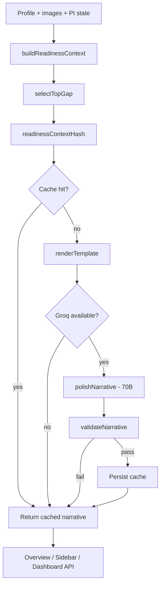

# Contextual Readiness Narratives — Design Spec

**Date:** 2026-06-24  
**Status:** Approved for implementation  
**Depends on:** PITS + Package Intelligence (production final, 2026-06-24)  
**Related:** `docs/superpowers/specs/2026-06-22-image-typing-service-design.md`, bio-writer (`src/domains/talent/services/bio-writer/`)

---

## 1. Problem

Pholio already knows *what* is missing from a talent's package — readiness keys, Package Intelligence advisories, digitals recency. What talent still see is **generic checklist copy**:

- Sidebar: label + static `why` from `profileReadinessItems.js`
- Overview audit: gap label only (`Headshot`, `Current Digitals`)
- Dashboard `nextSteps`: templated titles from `profile-strength.js`

A working model doesn't need another percentage. They need **one credible sentence** that sounds like a booker nudging them: *what matters most right now, why it matters in industry terms, and where to go.*

Static copy is fine for a glossary. Contextual narratives are the difference between "software checklist" and "studio guidance."

---

## 2. Industry frame

From `standards.md` §3–4 and `lifecycle.md` §2, the readiness messages that actually move careers follow a fixed priority:

| Priority | Situation | What a booker would say |
|----------|-----------|-------------------------|
| **P0** | Minors without guardian consent | "We can't collect measurements or full-length until a guardian consents." |
| **P1** | Stale digitals (>90 days) | "Your polaroids are dated — refresh before the next submission." |
| **P1** | Styled shot tagged as digital | "This reads as book work, not a raw digital — agencies will set it aside." |
| **P1** | Missing headshot or full-length digital | "Open every submission with a clean headshot and a full-length frame." |
| **P2** | Missing improve-tier slots (profile, smile, back, editorial) | "Side profile and a smile frame round out a competitive set." |
| **P2** | Stats / identity gaps | "Height and measurements are the first things a booker scans." |

**Terminology in output:** digitals (not selfies), book/portfolio (not frames gallery), comp card, submission — never "AI suggests" or "optimize your profile."

---

## 3. Product principles

1. **Verified facts only** — same discipline as bio-writer: narrative is generated from a structured context object, never from freeform profile scraping or invention.
2. **One primary narrative** — one sentence for the top gap on Overview and sidebar header; optional expanded copy for top 3 gaps in audit (still one sentence each).
3. **Template-first, LLM-second** — deterministic templates cover ~80% of gaps instantly with zero cost; Groq polishes or personalizes only when cache miss and API available.
4. **Fail open** — if Groq is down, user always sees template copy. Never blank, never spinner-only.
5. **No new AI chrome** — no chatbot, no "AI-powered" badge, no pulsing dots. Plain serif/body text inline where guidance already lives.
6. **Free for all talent** — operational guidance, not Studio+ marketing copy. (Bio writer remains Studio+.)
7. **Invalidate on change** — narrative regenerates when readiness hash changes (upload, tag edit, stats save).

---

## 4. Non-goals (v1)

- Multi-paragraph coaching or conversational follow-up
- Agency-specific rule engines ("Ford wants X")
- Narratives for agency dashboard
- Replacing static `why` strings in `profileReadinessItems.js` (templates derive from them)
- Blocking navigation or submission based on narrative
- Notifications push for narrative updates (defer to existing readiness notifications)

---

## 5. Architecture



### 5.1 Module layout (mirror bio-writer)

| File | Role |
|------|------|
| `src/domains/talent/services/readiness-narrative/context-builder.js` | Build verified context from profile, strength, package intelligence |
| `src/domains/talent/services/readiness-narrative/gap-priority.js` | Select top gap + ranked list (deterministic) |
| `src/domains/talent/services/readiness-narrative/templates.js` | Industry-accurate template strings per gap/advisory id |
| `src/domains/talent/services/readiness-narrative/narrative-writer.js` | Template render + optional Groq polish + validation |
| `src/domains/talent/services/readiness-narrative/cache.js` | Hash, read/write cache on profile row |
| `src/domains/talent/routes/readiness-narrative.js` | `GET /api/talent/readiness/narrative` |
| `client/src/domains/talent/hooks/useReadinessNarrative.js` | React Query hook |

---

## 6. Gap priority algorithm

Deterministic ordering — **same input always yields same top gap.** Integrates Package Intelligence advisories ahead of generic improve-tier items.

```javascript
// Pseudocode — gap-priority.js
function selectRankedGaps({ profile, strength, packageIntel }) {
  const gaps = [];

  // P0 — compliance
  if (isMinor(profile) && !hasGuardianConsent(profile))
    gaps.push({ key: "guardian_consent", tier: "required", source: "compliance" });
  if (isMinor(profile) && !hasWorkPermitOnFile(profile))
    gaps.push({ key: "work_permit", tier: "required", source: "compliance" });

  // P1 — package intelligence advisories (warn severity first)
  for (const adv of packageIntel.advisories.filter((a) => a.severity === "warn")) {
    gaps.push({ key: adv.id, tier: "required", source: "advisory", advisory: adv });
  }

  // P1 — required readiness from profile-strength missing fields
  for (const field of strength.allNextSteps.filter((f) => f.tier === "Required"))
    gaps.push({ key: field.key, tier: "required", source: "readiness", field });

  // P2 — improve advisories (info)
  for (const adv of packageIntel.advisories.filter((a) => a.severity === "info"))
    gaps.push({ key: adv.id, tier: "improve", source: "advisory", advisory: adv });

  // P2 — improve readiness
  for (const field of strength.allNextSteps.filter((f) => f.tier === "Improve"))
    gaps.push({ key: field.key, tier: "improve", source: "readiness", field });

  return dedupeByKey(gaps);
}
```

**Dedup rules:**
- If `stale_digitals` advisory present, suppress generic `digitals_recency` readiness key (same message).
- If `portfolio_as_digital` present, prioritize over `photo_headshot` when headshot slot is technically filled by a mislabeled image.

---

## 7. Context object (verified facts only)

```typescript
type ReadinessNarrativeContext = {
  talentName: string;           // first name only for greeting
  topGap: {
    key: string;                // e.g. "stale_digitals", "photo_headshot"
    tier: "required" | "improve";
    label: string;              // from profileReadinessItems or advisory
    action: string;             // CTA verb phrase: "Reshoot your digitals"
    link: string;               // deep link
  };
  facts: {
    digitalsAgeDays?: number;     // from PI recency.oldestDays
    digitalsStaleThreshold: 90;
    untypedFrameCount?: number;
    styledDigitalCount?: number;  // portfolio_as_digital advisories
    missingSlotLabels?: string[]; // human labels for batch gaps
    city?: string;
    isMinor?: boolean;
  };
  templateText: string;         // pre-rendered fallback (always set)
};
```

Built by `buildReadinessContext(profile, images)`:
1. Run `calculateProfileStrength({ ...profile, images })`
2. Run `analyzePackageIntelligence({ images })`
3. Run `selectRankedGaps(...)`
4. Map top gap → template via `templates.js`
5. Attach numeric facts from PI (days, counts) — **never invent numbers**

---

## 8. Template catalog (v1)

Templates are the **source of truth** for copy; LLM may rephrase but not add facts.

| Gap key | Template (variables in `{braces}`) |
|---------|-----------------------------------|
| `guardian_consent` | A parent or guardian must consent before we can collect measurements or full-length imagery. |
| `work_permit` | Add your current work permit — minors need one on file before booking in most markets. |
| `stale_digitals` | Your digitals are {digitalsAgeDays} days old — agencies expect a fresh set within {digitalsStaleThreshold} days. |
| `portfolio_as_digital` | One of your digitals reads as styled book work — swap in a raw, plain-background frame before you submit. |
| `busy_background` | Digitals land best on a plain wall — one frame reads environmental. |
| `photo_headshot` | Add a clean, natural headshot — it opens every agency digitals set. |
| `photo_full_body` | Add a full-length frame so bookers can verify your proportions head to toe. |
| `photo_profile` | A side profile completes the standard digitals set — bookers assess bone structure from it. |
| `photo_smile` | Add a smiling headshot — commercial boards want at least one approachable frame. |
| `photo_back` | Add a back view — hair and posture read from behind. |
| `photo_editorial` | Tag a styled portfolio shot as editorial to show high-fashion range beyond digitals. |
| `photo_lifestyle` | Add a commercial or lifestyle frame for casting breadth. |
| `digitals_recency` | (alias → use `stale_digitals` template) |
| `measurements` | Confirm your bust, waist, and hips — core stats agents scan before your book. |
| `height` | Add your height — it's the first stat filtered on every submission. |
| `name` / `city` / `dob` / `gender` | Use existing `why` from `profileReadinessItems.js` verbatim as template. |
| `pending_classification` | {untypedFrameCount} frame(s) still need a type read — open your book to place them. |
| `_complete` | Your package is submission-ready — keep digitals current within three months. |

---

## 9. Groq polish layer

### When to call Groq

| Condition | Action |
|-----------|--------|
| Cache hit | Skip Groq |
| Cache miss + `GROQ_API_KEY` set | Polish template |
| Cache miss + no API key | Return template only |
| Groq error / timeout | Return template only |
| Validation fail after polish | Return template only |

### Model & params

- **Model:** `llama-3.3-70b-versatile` (same as bio-writer; editorial tone)
- **Temperature:** `0.35` (more constrained than bio)
- **Max tokens:** `80` (one sentence, ~25 words target)

### System prompt

```
You are a senior agency booker writing one sentence of guidance for a model updating their digitals package.

Rules:
- One sentence only, maximum 28 words
- Use ONLY facts in VERIFIED CONTEXT
- Never invent stats, agencies, timelines, or outcomes
- Use industry terms: digitals, book, comp card, submission — not "photos" or "AI"
- Calm, direct, premium tone — no exclamation marks, no "Great job!", no filler
- Do not mention Pholio or AI
- Return plain text only
```

### User prompt

```
VERIFIED CONTEXT:
Top gap: {label}
Action: {action}
Facts:
{formatted facts}

Template (preserve all facts exactly):
"{templateText}"

Task: Rewrite the template as one stronger sentence. Keep every number and constraint. Plain text only.
```

### Output validation (`output-validator.js`)

Reject polish and fall back to template if:

- Word count > 35
- Contains banned phrases: `AI`, `optimize`, `algorithm`, `machine`, `Great`, `Awesome`, `!`
- Introduces numbers not in context
- Empty or multi-paragraph

---

## 10. Caching

### Storage

Add to `profiles` table via migration:

```javascript
// profiles.readiness_narrative_cache — JSON/text nullable
{
  "hash": "sha256 hex",
  "primary": "Your digitals are 112 days old — refresh before your next submission.",
  "items": [
    { "key": "stale_digitals", "text": "..." },
    { "key": "photo_profile", "text": "..." }
  ],
  "generated_at": "ISO8601",
  "source": "template | groq"
}
```

SQLite: `text` column. PostgreSQL: `jsonb`.

### Hash inputs

Stable stringify of:

- Top 5 gap keys (ordered from `selectRankedGaps`)
- `packageIntel.recency.oldestDays`
- `packageIntel.advisories` ids + severities
- Required/improve completion bitmap (fieldCompletion keys)
- Minor consent flags

Exclude: profile views, analytics, timestamps unrelated to package.

### Invalidation triggers

Regenerate cache (async, non-blocking) on:

- Image upload / delete / metadata PATCH (shot_type, image_type)
- Profile PATCH affecting readiness fields
- Guardian consent / work permit update

Hook from existing routes (`media.js` PATCH, `profile.js` PATCH) via `scheduleReadinessNarrativeRefresh(profileId)` — debounced 3s, same pattern as discover reindex.

---

## 11. API

### `GET /api/talent/readiness/narrative`

**Auth:** `requireRole('TALENT')`

**Response:**

```json
{
  "success": true,
  "data": {
    "primary": "Your digitals are 112 days old — refresh before your next submission.",
    "items": [
      {
        "key": "stale_digitals",
        "tier": "required",
        "label": "Current Digitals",
        "text": "Your digitals are 112 days old — refresh before your next submission.",
        "link": "/dashboard/talent/media"
      }
    ],
    "generatedAt": "2026-06-24T18:00:00.000Z",
    "source": "groq",
    "cacheHit": true
  }
}
```

**Query params (v1):**

- `limit=3` — max items (default 3)

**Performance:** Cache hit < 50ms. Cache miss with Groq < 800ms. Client shows template from client-side PI immediately if API pending (see §12).

Mount in `src/domains/talent/routes/index.js` alongside bio routes.

---

## 12. UI integration

### 12.1 Overview — primary next step

**File:** `client/src/domains/talent/pages/OverviewPage/index.jsx`

Above or within the Submission Readiness / audit section, add one line:

```jsx
<p className="ov-readiness-narrative">{narrative.primary}</p>
```

- Show skeleton while `useReadinessNarrative` loading
- Fallback: client-computed template from `packageIntelligence` + top gap (instant, no API wait)

**No new hero KPI.** Narrative supports existing Package label (`Ready` / `Update digitals`).

### 12.2 Profile strength sidebar

**File:** `ProfileStrengthSidebar.jsx`

When audit panel open (`showWhy`), replace static `item.why` with `narrative.items.find(i => i.key === item.key)?.text ?? item.why` for top 3 gaps only.

Primary narrative also shown once above gap list when `totalGaps > 0`:

```jsx
{primaryNarrative && !isComplete ? (
  <p className={styles.narrativeLead}>{primaryNarrative}</p>
) : null}
```

CSS: muted `--ag-text-2`, 14px, no badge, no icon.

### 12.3 Dashboard API (optional v1)

**File:** `src/domains/talent/routes/dashboard.js`

Extend completeness payload with `narrativePrimary` so legacy consumers get the sentence without a second fetch. Not required if client hook batches.

### 12.4 Media workspace

**No change v1.** DigitalsBookPanel already shows advisories; avoid duplicate narrative under every frame.

---

## 13. Client hook

```javascript
// useReadinessNarrative.js
export function useReadinessNarrative({ limit = 3 } = {}) {
  return useQuery({
    queryKey: ['readiness-narrative', limit],
    queryFn: () => talentApi.getReadinessNarrative({ limit }),
    staleTime: 60_000,
    placeholderData: (prev) => prev, // keep last narrative while refetching
  });
}
```

Add `talentApi.getReadinessNarrative` → `GET /api/talent/readiness/narrative`.

Invalidate on: media mutations, profile save, `['auth-user']` refetch.

---

## 14. Cost & rate limits

| Scenario | Groq calls |
|----------|------------|
| Steady state (cached) | 0 |
| Upload batch (5 images) | 1 (debounced refresh) |
| Profile stat edit | 1 (debounced) |
| Cold profile, first visit | 1 |

**Estimate:** ~1 call per active talent per day max → ~500 profiles × 30 days × ~200 tokens ≈ **< $2/mo** at 70B pricing.

**Rate limit:** Max 1 Groq polish per profile per 60 seconds (in-memory debounce in `narrative-writer.js`).

---

## 15. Testing strategy

| Layer | File | Cases |
|-------|------|-------|
| Gap priority | `tests/talent/readiness-narrative-gap-priority.test.js` | Stale beats improve; minor consent first; dedup recency |
| Templates | `tests/talent/readiness-narrative-templates.test.js` | Variable substitution; all keys covered |
| Context builder | `tests/talent/readiness-narrative-context.test.js` | PI facts flow; no invent |
| Validator | `tests/talent/readiness-narrative-validator.test.js` | Rejects AI hype, extra numbers |
| Integration | `tests/talent/readiness-narrative-route.test.js` | 401, cache hit, template fallback when Groq mocked fail |
| Groq | Skipped in CI | Manual smoke with `GROQ_API_KEY` |

---

## 16. Rollout

| Phase | Deliverable |
|-------|-------------|
| **R1** | Server modules + migration + GET route + templates only (no Groq) |
| **R2** | Groq polish + cache + invalidation hooks |
| **R3** | Overview + sidebar UI + client hook |
| **R4** | Dashboard API field + monitoring |

Feature flag: `READINESS_NARRATIVE_GROQ=true` (default true when key present). Templates always on.

---

## 17. Files touched (summary)

**Create**

- `migrations/20260625120000_add_readiness_narrative_cache.js`
- `src/domains/talent/services/readiness-narrative/*.js` (5 modules)
- `src/domains/talent/routes/readiness-narrative.js`
- `client/src/domains/talent/hooks/useReadinessNarrative.js`
- `tests/talent/readiness-narrative-*.test.js`

**Modify**

- `src/domains/talent/routes/index.js` — mount route
- `src/domains/talent/routes/media.js` — invalidation hook
- `src/domains/talent/routes/profile.js` — invalidation hook
- `client/src/domains/talent/api/talent.js` — API method
- `client/src/domains/talent/pages/OverviewPage/index.jsx` — primary line
- `client/src/domains/talent/components/ProfileStrengthSidebar.jsx` + `.module.css`
- `client/src/domains/talent/pages/OverviewPage/OverviewPage.css` — `.ov-readiness-narrative`

---

## 18. Acceptance criteria

| # | Criterion |
|---|-----------|
| 1 | Top gap on a stale-digitals profile mentions age in days and 90-day norm |
| 2 | Portfolio headshot mislabeled as digital surfaces `portfolio_as_digital` narrative before generic headshot gap |
| 3 | Minor without consent sees guardian narrative first — no measurement prompt |
| 4 | Groq failure returns template within 200ms — never empty UI |
| 5 | Same package state → cache hit — no second Groq call within 60s |
| 6 | Overview + sidebar show narrative as plain text — no banned UI patterns |
| 7 | Polished output never contains "AI" or invented agency names |
| 8 | All unit tests pass; route test passes with mocked Groq |

---

## 19. Spec self-review

- [x] Builds on Package Intelligence — not parallel system
- [x] Industry terminology enforced in templates and prompts
- [x] Minors branch prioritized in gap algorithm
- [x] Template fallback — production-safe without Groq
- [x] No chatbot / badge UI
- [x] Free tier — not Studio+ gated
- [x] Scoped to single implementation plan (~3–4 days)

---

## 20. Open questions (defaults chosen)

| Question | Decision |
|----------|----------|
| Studio+ gate? | **No** — free for all talent |
| Replace static `why` entirely? | **No** — narrative overrides only for top 3 gaps when API returns |
| Generate client-side without API? | **Yes** — instant template fallback from PI + gap priority (client port of templates.js) |
| Store cache on profile vs separate table? | **Profile column** — simpler, one row per talent |
| 8B vs 70B for polish? | **70B** — worth cost for one sentence; templates handle volume |
